# Galana SAP SD Business Blueprint — AI/RAG Knowledge Repository

---

## Document Metadata

```yaml
client: Galana
solution: SAP GROW Public Cloud
module: SAP SD (Sales and Distribution)
document_type: Business Blueprint (BBP)
repository_type: AI_RAG_Knowledge_Repository
source_document: GE_SAP_SD_BBP_V2_2.pdf
version: V2.2
prepared_by: SAP Implementation Team
status: Draft / Working Document
classification: Confidential — Internal Use Only
```

---

## Table of Contents

1. [Executive Summary](#1-executive-summary)
2. [Business Overview — Galana Group](#2-business-overview--galana-group)
3. [Project Scope](#3-project-scope)
4. [Business Objectives and Strategic Goals](#4-business-objectives-and-strategic-goals)
5. [Current Business Challenges](#5-current-business-challenges)
6. [Organizational Structure](#6-organizational-structure)
7. [SAP Organizational Structure — Sales and Distribution](#7-sap-organizational-structure--sales-and-distribution)
8. [In-Scope Business Processes](#8-in-scope-business-processes)
9. [Out-of-Scope Processes](#9-out-of-scope-processes)
10. [Business Process Descriptions — Order-to-Cash (OTC)](#10-business-process-descriptions--order-to-cash-otc)
11. [Sales Order Management](#11-sales-order-management)
12. [Pricing and Conditions](#12-pricing-and-conditions)
13. [Customer Master Data](#13-customer-master-data)
14. [Material Master Data (SD View)](#14-material-master-data-sd-view)
15. [Delivery and Shipping Processing](#15-delivery-and-shipping-processing)
16. [Billing and Invoicing](#16-billing-and-invoicing)
17. [Credit Management](#17-credit-management)
18. [Returns and Complaints Management](#18-returns-and-complaints-management)
19. [Inter-Company Sales](#19-inter-company-sales)
20. [Third-Party / Drop-Shipment Processing](#20-third-party--drop-shipment-processing)
21. [Contract and Scheduling Agreement Management](#21-contract-and-scheduling-agreement-management)
22. [Output and Forms Management](#22-output-and-forms-management)
23. [SAP Solution Design Decisions](#23-sap-solution-design-decisions)
24. [Business Rules Repository](#24-business-rules-repository)
25. [Approval Workflows](#25-approval-workflows)
26. [Master Data Requirements](#26-master-data-requirements)
27. [Integration Requirements](#27-integration-requirements)
28. [Reporting Requirements](#28-reporting-requirements)
29. [Security and Authorization Considerations](#29-security-and-authorization-considerations)
30. [Assumptions](#30-assumptions)
31. [Dependencies](#31-dependencies)
32. [Risks](#32-risks)
33. [Constraints](#33-constraints)
34. [Open Items and Outstanding Decisions](#34-open-items-and-outstanding-decisions)
35. [Exception Scenarios and Edge Cases](#35-exception-scenarios-and-edge-cases)
36. [Known Limitations](#36-known-limitations)
37. [Key Decisions Log](#37-key-decisions-log)
38. [Glossary of Terms and Abbreviations](#38-glossary-of-terms-and-abbreviations)

---

## 1. Executive Summary

### 1.1 Purpose of This Document

This Business Blueprint (BBP) documents the agreed-upon SAP Sales and Distribution (SD) solution design for Galana Group as part of the SAP GROW Public Cloud implementation project. It captures the future-state business processes, SAP configuration decisions, master data requirements, integration touchpoints, and all business rules that have been agreed upon between the Galana project team and the SAP implementation partners.

This document serves as:

- The authoritative reference for SAP SD configuration and development activities.
- The primary knowledge transfer and handover document for the SD workstream.
- A living record of all business process decisions made during the Blueprint phase.
- The foundation for the Test Scripts, User Acceptance Testing (UAT), and End-User Training materials.

### 1.2 Scope Summary

The BBP covers the end-to-end Order-to-Cash (OTC) process for Galana's business operations in the SAP GROW Public Cloud environment. The key areas covered include:

- Sales Order Management (standard orders, rush orders, returns)
- Pricing and Condition Management
- Customer Master Data
- Delivery and Shipping
- Billing and Invoice Processing
- Credit Management
- Returns and Complaints Handling
- Inter-Company Sales Processes
- Third-Party / Drop-Shipment Processing
- Contract Management
- Output and Forms (order confirmations, delivery notes, invoices)

### 1.3 Document Version and Approval Status

| Version | Date | Author | Description |
|---------|------|--------|-------------|
| V1.0 | Initial draft | SAP SD Team | First draft for review |
| V2.0 | Revised | SAP SD Team | Post-workshop update |
| V2.2 | Current | SAP SD Team | Revised post client review |

---

## 2. Business Overview — Galana Group

### 2.1 Company Background

Galana is a petroleum and energy distribution company operating across multiple African markets. The company is engaged in the importation, storage, distribution, and retail sale of petroleum products and related energy commodities. Galana's business activities span the entire downstream energy supply chain — from importation and bulk storage at terminal facilities, through to wholesaling and retail distribution to end customers.

Galana operates across multiple legal entities and countries, with each entity potentially functioning as a separate company code in SAP. The company's customer base includes:

- Large industrial and commercial accounts (bulk buyers)
- Government and parastatal entities
- Petrol station operators and dealers (resellers)
- Retail customers at company-owned service stations

### 2.2 Industry Context — Downstream Petroleum Distribution

To understand the SAP SD solution, it is important to understand the business context of petroleum distribution:

- **Petroleum products** are typically sold in large volumes (litres, metric tonnes, kilolitres) and prices are highly sensitive to global commodity markets, government regulation, and foreign exchange rates.
- **Pricing** in many African markets is partially or fully regulated by government fuel pricing authorities, meaning that customer-facing prices cannot always be freely set by the company.
- **Credit risk** is significant — large customers often operate on credit terms, and managing credit exposure is a critical business control.
- **Logistics and delivery** involve specialized transport (tanker trucks, pipelines, coastal vessels), and proof of delivery (POD) is a critical business and financial control.
- **Inter-company transactions** are common — products may be sourced from one Galana entity and sold by another, requiring inter-company billing and transfer pricing.
- **Excise duties and levies** are imposed by governments on petroleum products and must be reflected accurately in pricing and billing.

### 2.3 Geographic Operations

Galana operates across the following countries and markets (as relevant to this BBP):

- Multiple African jurisdictions, each with separate legal and tax requirements.
- Each country of operation may correspond to a separate Company Code in SAP.
- Currency considerations: each country may operate in its local currency, with inter-company transactions requiring foreign currency handling.

---

## 3. Project Scope

### 3.1 SAP GROW Public Cloud — SD Module Scope

The SAP GROW Public Cloud implementation for Galana covers the SAP SD module as a core workstream. The SD module encompasses all sales, customer, delivery, and billing processes.

### 3.2 In-Scope Processes

The following business processes are confirmed as in-scope for this SAP SD implementation:

| # | Process Area | Process Description |
|---|--------------|---------------------|
| 1 | Sales Order Management | Creation and management of customer sales orders (standard, rush, credit memo requests, debit memo requests) |
| 2 | Quotation Management | Creation and conversion of sales quotations to sales orders |
| 3 | Pricing and Conditions | Customer-specific pricing, discount management, surcharges, freight, tax conditions |
| 4 | Customer Master Data | Customer master data creation, extension, and maintenance across all sales areas |
| 5 | Material Master (SD views) | Material master SD view maintenance for saleable products |
| 6 | Delivery Processing | Outbound delivery creation, picking, packing (where applicable), goods issue |
| 7 | Shipping | Transportation planning, route determination, delivery scheduling |
| 8 | Billing | Invoice creation, credit/debit memo processing, pro-forma invoices, inter-company billing |
| 9 | Credit Management | Customer credit limit management, credit exposure monitoring, credit block/release |
| 10 | Returns Processing | Returns orders, returns deliveries, credit memo processing for returns |
| 11 | Complaints Management | Customer complaints, subsequent delivery free-of-charge, subsequent debit/credit |
| 12 | Inter-Company Sales | Sales between Galana legal entities — inter-company billing process |
| 13 | Third-Party Processing | Sales orders fulfilled by a third-party vendor — drop shipment process |
| 14 | Contract Management | Value contracts, quantity contracts with release orders |
| 15 | Scheduling Agreements | Scheduling agreements with delivery schedules |
| 16 | Output Management | Order confirmations, delivery notes, invoices, credit memos — print and electronic output |
| 17 | Reporting | Standard SAP SD reports and key operational reports |

### 3.3 Out-of-Scope Processes

The following items are explicitly confirmed as out of scope for this SAP SD implementation:

| # | Process / Item | Reason / Notes |
|---|----------------|----------------|
| 1 | Customer Relationship Management (CRM) | Not in scope for current phase — SAP CRM / C4C not being implemented |
| 2 | Trade Promotion Management | Not in scope |
| 3 | SAP Variant Configuration (VC) | Products are not configurable — not applicable |
| 4 | Rebate Processing (legacy SD Rebates) | To be confirmed — may use condition-based rebates or separate agreement |
| 5 | Retail / Point-of-Sale (POS) integration | Retail POS systems not integrated in current phase |
| 6 | e-Commerce / Customer Self-Service portal | Not in scope for current phase |
| 7 | Advanced Available-to-Promise (aATP) | Standard ATP check in scope; advanced ATP not in scope |
| 8 | Revenue Recognition (IFRS 15) | To be managed in FI — SD revenue recognition not in scope |
| 9 | Subscription Billing | Not applicable to business model |
| 10 | SAP Transportation Management (TM) | Standard shipping in SAP SD in scope; full SAP TM not in scope |

---

## 4. Business Objectives and Strategic Goals

### 4.1 Primary Business Objectives

The Galana SAP SD implementation is driven by the following business objectives:

1. **Standardization of Sales Processes**: Implement a single, standardized Order-to-Cash process across all Galana entities and markets, replacing fragmented legacy systems and manual processes.

2. **Improved Customer Master Data Quality**: Establish a single, clean, and complete customer master data set in SAP, eliminating duplicate records and incomplete data that currently cause operational issues.

3. **Real-Time Credit Management**: Enable real-time credit exposure monitoring and automated credit blocking to reduce bad debt risk and improve financial control.

4. **Automated Billing and Invoicing**: Replace manual and semi-automated billing processes with fully automated billing runs in SAP, reducing errors and invoice processing time.

5. **Pricing Accuracy and Control**: Implement a structured SAP condition technique pricing model that accurately captures all pricing elements (base price, discounts, surcharges, taxes, levies) and eliminates manual price overrides outside approved workflows.

6. **Integrated Inventory and Sales**: Ensure real-time integration between SD sales orders/deliveries and MM (Materials Management) inventory movements, providing accurate stock visibility.

7. **Improved Reporting and Business Intelligence**: Provide management with real-time access to sales performance, customer outstanding balances, delivery performance, and revenue data.

8. **Regulatory Compliance**: Ensure that SAP SD processes support compliance with local tax regulations, fuel levy requirements, and government-mandated pricing structures in each country of operation.

9. **Reduction of Manual Effort**: Automate routine transactional tasks (billing runs, output generation, credit checks) to free up staff time for value-added activities.

10. **Scalability**: Implement a solution that can scale to support business growth, new markets, and new product lines without requiring major system re-architecture.

### 4.2 Success Criteria

| # | Success Criterion | Measurement |
|---|-------------------|-------------|
| 1 | All sales orders processed in SAP from Go-Live | 100% of sales orders created in SAP post Go-Live |
| 2 | Billing cycle time reduction | Invoice issued within 24 hours of goods issue |
| 3 | Credit exposure accuracy | Real-time credit check at order creation |
| 4 | Customer master data quality | Zero duplicate customer records at Go-Live |
| 5 | Pricing accuracy | Invoice price matches agreed customer price — zero manual overrides without approval |
| 6 | User adoption | All relevant users trained and actively using SAP within 30 days of Go-Live |

---

## 5. Current Business Challenges

### 5.1 Pain Points in Current State

The following business challenges in the current operating environment are being addressed by the SAP SD implementation:

| # | Challenge Area | Description |
|---|----------------|-------------|
| 1 | Fragmented Systems | Sales orders managed in multiple disparate systems (spreadsheets, legacy ERP, manual registers) across different countries and entities |
| 2 | No Real-Time Inventory Visibility | Sales teams cannot see real-time stock availability, leading to over-selling and delivery failures |
| 3 | Manual Pricing | Prices are manually calculated and entered on invoices, leading to frequent pricing errors and disputes |
| 4 | Poor Credit Control | Customer credit limits are not systematically enforced — sales to blocked customers occur, increasing bad debt |
| 5 | Billing Delays | Invoices are raised manually after delivery, often with significant delays — impacting cash collection |
| 6 | Customer Data Duplication | The same customer exists under multiple records in legacy systems, causing reporting inaccuracies and billing issues |
| 7 | No Standard Process | Each country/entity follows slightly different processes, making consolidated reporting impossible |
| 8 | Lack of Audit Trail | Manual processes have poor audit trails — it is difficult to trace who approved what, when |
| 9 | Returns Mismanagement | Customer returns are not systematically tracked — credit notes are issued without proper goods return verification |
| 10 | Inter-Company Complexity | Inter-company transactions are managed manually with high risk of errors and reconciliation issues |

---

## 6. Organizational Structure

### 6.1 Galana Group Legal Entities

Galana operates as a group of companies, with each legal entity potentially represented as a separate Company Code in SAP. The exact list of company codes is defined in the SAP FI/CO (Financial Accounting and Controlling) BBP, but the SD design must align with the following structure:

- Each country of operation has at least one legal entity (Company Code).
- Sales operations in each country are organized under that country's Company Code.
- Inter-company transactions occur between different Company Codes within the Galana group.

### 6.2 Sales Organizational Structure Overview

The SAP SD sales organizational structure mirrors Galana's commercial operations hierarchy:

- **Sales Organization**: Represents Galana's sales responsibility at the highest level — typically one per country or major business unit.
- **Distribution Channel**: Represents the route to market (e.g., Wholesale, Retail, Direct Sales, Inter-Company).
- **Division**: Represents product divisions or business segments (e.g., Fuel Products, Lubricants, LPG).
- **Sales Area**: The unique combination of Sales Organization + Distribution Channel + Division — this is the key unit of commercial activity in SAP SD.
- **Sales Office**: Sub-organizational unit within a Sales Organization representing a regional office or depot.
- **Sales Group**: A team of sales representatives within a Sales Office.

---

## 7. SAP Organizational Structure — Sales and Distribution

### 7.1 Sales Organization Design

A Sales Organization in SAP SD is responsible for:
- Defining pricing and sales conditions.
- Managing customer credit limits (in combination with FI).
- Being the legal entity responsible for billing.

Each Sales Organization is assigned to exactly one Company Code.

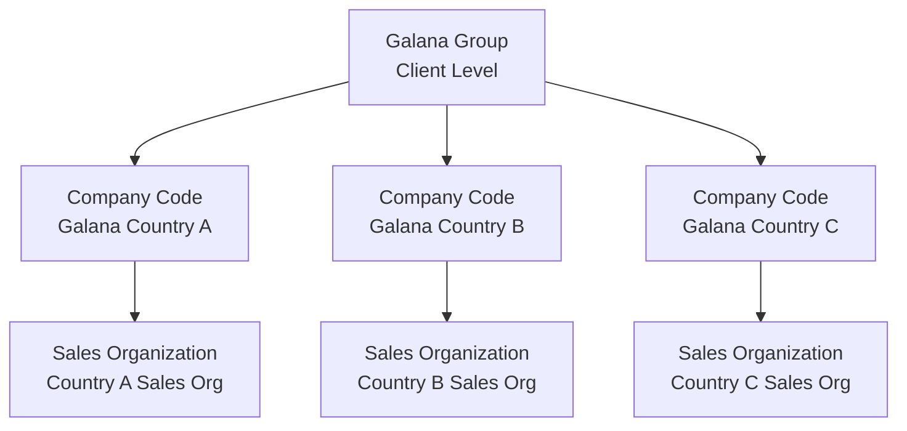

### 7.2 Distribution Channels

Distribution channels define how products reach the end customer. The following distribution channels are defined for Galana:

| Distribution Channel Code | Description | Business Meaning |
|--------------------------|-------------|-----------------|
| 10 | Wholesale | Large volume bulk sales to industrial and commercial customers |
| 20 | Retail | Sales through company-owned petrol stations or dealer-operated stations |
| 30 | Direct Sales | Direct sales to government and parastatal bodies |
| 40 | Inter-Company | Sales between Galana group entities (inter-company transfers) |

> **Business Rule**: The distribution channel determines which pricing conditions, customer master records, and output types are applicable to a transaction.

### 7.3 Divisions

Divisions represent Galana's product portfolio segments:

| Division Code | Description |
|---------------|-------------|
| 10 | Fuel Products (Petrol, Diesel, Jet Fuel, Heavy Fuel Oil) |
| 20 | Lubricants and Greases |
| 30 | LPG (Liquefied Petroleum Gas) |
| 40 | Bitumen and Asphalt Products |
| 00 | Cross-Division (used for customers buying across multiple divisions) |

> **Business Rule**: Division 00 (cross-division) is used in customer master data for customers who purchase products from multiple divisions, enabling a single customer record to be used across all relevant sales areas.

### 7.4 Sales Area Matrix

A Sales Area is the intersection of Sales Organization, Distribution Channel, and Division. Only valid combinations are configured in SAP.

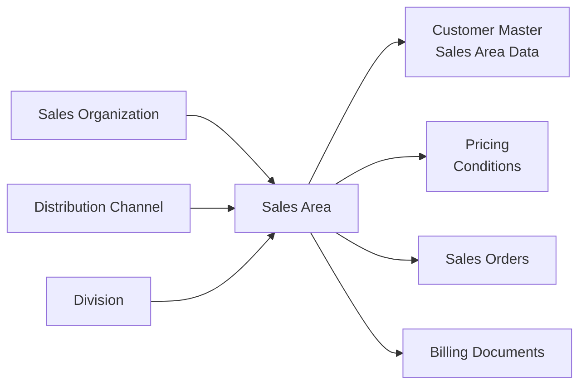

### 7.5 Plants and Storage Locations

Plants represent Galana's physical operational facilities (terminals, depots, storage facilities) and are the key link between SD (Sales) and MM (Materials Management) / WM (Warehouse Management).

| Plant | Description | Location |
|-------|-------------|----------|
| (Defined per country) | Terminal / Main Depot | Primary storage and dispatch facility |
| (Defined per country) | Secondary Depot | Regional distribution depot |

> **Business Rule**: Each Sales Organization is assigned one or more plants from which it can fulfill sales orders. The delivering plant on a sales order determines which warehouse stock is reduced at Goods Issue.

### 7.6 Complete SAP Organizational Hierarchy

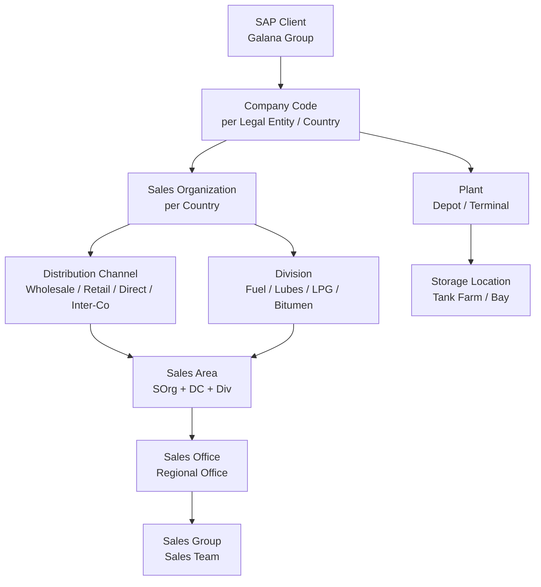

### 7.7 Shipping Points

Shipping Points represent the physical location and organizational unit from which deliveries are dispatched. Each Shipping Point is assigned to one or more plants.

| Shipping Point | Description | Notes |
|---------------|-------------|-------|
| (Per terminal) | Main Terminal Shipping Point | Bulk liquid dispatch |
| (Per depot) | Depot Shipping Point | Secondary dispatch point |

> **Business Rule**: The Shipping Point is determined automatically during sales order processing based on the delivering plant, the shipping condition on the customer master, and the loading group on the material master. This automatic determination must be configured correctly to avoid manual overrides.

---

## 8. In-Scope Business Processes

### 8.1 End-to-End Order-to-Cash Process Overview

The Order-to-Cash (OTC) process encompasses all activities from the point a customer places an order to the point Galana receives payment. The SAP SD module manages the first part of this cycle (order through to billing); the collection and cash application portion is handled in SAP FI (Accounts Receivable).

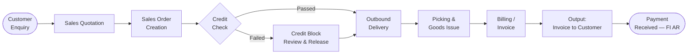

### 8.2 Process List and SAP Transaction Reference

| Process | SAP Transaction | Description |
|---------|----------------|-------------|
| Create Quotation | VA21 | Create sales quotation |
| Change Quotation | VA22 | Modify existing quotation |
| Display Quotation | VA23 | View quotation |
| Create Sales Order | VA01 | Create new sales order |
| Change Sales Order | VA02 | Modify existing sales order |
| Display Sales Order | VA03 | View sales order |
| Create Outbound Delivery | VL01N | Create delivery from sales order |
| Change Outbound Delivery | VL02N | Modify delivery |
| Post Goods Issue | VL02N | Post goods issue on delivery |
| Create Billing Document | VF01 | Create individual billing document |
| Billing Due List | VF04 | Process multiple billing documents |
| Create Credit Memo Request | VA01 (order type CR) | Initiate credit to customer |
| Create Debit Memo Request | VA01 (order type DR) | Initiate debit to customer |
| Returns Order | VA01 (order type RE) | Process customer return |
| Credit Limit Change | FD32 | Change customer credit limit |
| Credit Overview | FD33 | View customer credit exposure |
| Release Credit Block | VKM3 / VKM1 | Release sales orders from credit block |

---

## 9. Out-of-Scope Processes

Refer to Section 3.3 for the complete out-of-scope list. Additionally, the following process variations are explicitly excluded:

| Excluded Variation | Standard Process Used Instead |
|--------------------|-------------------------------|
| Multi-level bill of materials (BOM) explosion in SD | Products sold as individual line items |
| Batch management for petroleum products (if not configured in MM) | Subject to MM BBP decision — SD will align |
| Serial number management | Not applicable for bulk liquids |
| Consignment processing (if not agreed) | Standard sale assumed unless confirmed |
| Kanban-controlled replenishment | Not applicable |

---

## 10. Business Process Descriptions — Order-to-Cash (OTC)

### 10.1 Process Overview

The Order-to-Cash cycle at Galana begins when a customer (or sales representative) initiates a request for petroleum products or related goods. The process ends when the customer's invoice is posted and the payment cycle is initiated in Accounts Receivable.

### 10.2 Trigger Events for Sales Order Creation

A sales order in SAP can be triggered by:

1. **Customer direct order**: Customer contacts Galana's sales team (phone, email, in-person) to place an order.
2. **Conversion from quotation**: A previously issued sales quotation is accepted by the customer and converted to a sales order.
3. **Contract release**: A release order is created against an existing value or quantity contract.
4. **Scheduling agreement delivery schedule**: Automatic or manual creation of delivery schedules under a scheduling agreement.
5. **Inter-company request**: An inter-company purchase order from another Galana entity triggers a sales order creation.

### 10.3 Standard OTC Process Flow — Detailed

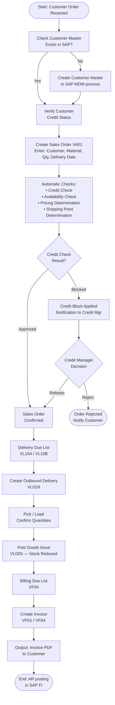

---

## 11. Sales Order Management

### 11.1 Sales Order Types

SAP Sales Order Types are configured to represent different business scenarios. Each order type has specific settings for item category determination, pricing, credit checks, and output.

| SAP Order Type | Description | Business Use |
|----------------|-------------|-------------|
| OR | Standard Order | Regular customer sales orders for petroleum products |
| RU | Rush Order | Urgent orders requiring same-day or next-day delivery |
| RE | Returns Order | Processing of customer returns with credit |
| CR | Credit Memo Request | Request to issue a credit memo to customer (without return) |
| DR | Debit Memo Request | Request to issue a debit memo to customer |
| QT | Quotation | Customer price quotations before order |
| KM | Consignment Fill-Up | (If consignment in scope) Replenishment of consigned stock |
| KA | Consignment Pick-Up | (If consignment in scope) Return of consigned stock |
| IV | Inter-Company Sales Order | Sales orders between Galana entities |
| NB | Third-Party Order | Orders fulfilled by external third-party vendor |

> **Business Rule**: The selection of the correct sales order type is critical. Incorrect order type usage will result in wrong item category determination, incorrect pricing procedures, and wrong billing document types being generated.

### 11.2 Standard Order (OR) — Process Description

The Standard Order is the most commonly used order type at Galana. It covers the majority of wholesale and direct sales transactions.

**Standard Order Processing Steps:**

1. Sales representative or customer service agent opens Transaction VA01 in SAP.
2. Selects order type **OR** (Standard Order).
3. Enters the **Sales Area** (Sales Organization, Distribution Channel, Division).
4. Enters the **Sold-To Party** (customer number).
5. SAP automatically populates:
   - Ship-To Party (from customer master, can be changed)
   - Bill-To Party (from customer master)
   - Payer (from customer master)
   - Payment Terms (from customer master)
   - Incoterms (from customer master)
   - Pricing Procedure (determined from sales area + customer pricing procedure + document pricing procedure)
6. Enters order line items:
   - Material number
   - Order quantity and unit of measure
   - Requested delivery date
7. SAP automatically determines:
   - Delivering Plant (from customer-material info record or material master)
   - Shipping Point (from plant + shipping condition + loading group)
   - Route (from shipping point + destination zone)
8. SAP performs **Availability Check** (ATP check) against plant stock.
9. SAP performs **Credit Check** against customer's credit limit.
10. SAP automatically determines **pricing** via the pricing procedure.
11. Order is saved — a unique sales order number is assigned.
12. Order confirmation output is generated (if configured).

### 11.3 Rush Order (RU)

A Rush Order is used when a customer requires immediate delivery on the same day or next business day. The Rush Order type is configured so that:

- Delivery creation happens immediately (no delivery scheduling delay).
- The requested delivery date defaults to today.
- The shipping point and route are set for expedited handling.
- A rush surcharge condition may be applied in pricing (if business decides to charge for urgency).

> **Business Rule**: Rush orders must still pass the standard credit check. A rush order cannot bypass credit management.

### 11.4 Item Categories

SAP Item Categories control the behavior of individual line items on a sales order. They determine whether an item is:
- Relevant for delivery and goods issue.
- Relevant for billing.
- Subject to availability check.
- Subject to credit check.
- Pricing active.

| Item Category | Description | Delivery Relevant | Billing Relevant | Pricing Active |
|---------------|-------------|-------------------|------------------|----------------|
| TAN | Standard Item | Yes | Yes | Yes |
| TANN | Free of Charge Item | Yes | No | No |
| TAX | Third-Party Item | No (PO to vendor) | Yes (customer) | Yes |
| RENN | Returns Item (no value) | Yes | No | No |
| REN | Returns Item (with credit) | Yes | Yes | Yes (negative) |
| TATX | Text Item | No | No | No |

### 11.5 Sales Order Fields — Key Business Fields

| Field | SAP Field Name | Business Meaning | Mandatory? |
|-------|---------------|------------------|------------|
| Order Type | AUART | Defines business scenario for the order | Yes |
| Sold-To Party | KUNNR | Customer placing the order | Yes |
| Ship-To Party | KUNNR (partner) | Customer receiving the goods | Yes |
| Bill-To Party | KUNNR (partner) | Customer to be invoiced | Yes |
| Payer | KUNNR (partner) | Customer responsible for payment | Yes |
| Material | MATNR | SAP material number of product ordered | Yes |
| Order Quantity | KWMENG | Quantity ordered | Yes |
| Unit of Measure | VRKME | Sales unit (L = Litres, KL = Kilolitres, MT = Metric Tonnes) | Yes |
| Requested Delivery Date | VDATU | Date customer needs delivery | Yes |
| Plant | WERKS | Plant from which goods are dispatched | Yes |
| Purchase Order Number | BSTKD | Customer's internal purchase order reference | Recommended |
| Pricing Date | PRSDT | Date used for price determination | Auto (today) |
| Payment Terms | ZTERM | Agreed payment terms (e.g., Net 30 days) | From customer master |
| Incoterms | INCO1 | Delivery terms (EXW, CIF, FOB, etc.) | From customer master |

### 11.6 Copy Control — Sales Order to Delivery to Billing

SAP Copy Control defines how data is copied from one document to the next in the document chain (Quotation → Order → Delivery → Billing). The following copy control rules apply:

| Source Document | Target Document | Copy Rule |
|-----------------|-----------------|-----------|
| Quotation (QT) | Sales Order (OR) | Header and item data copied; pricing re-determined |
| Sales Order (OR) | Outbound Delivery (LF) | Item quantities and shipping data copied |
| Sales Order (OR) | Invoice (F2) | Header and item data; billing quantity from delivery |
| Delivery (LF) | Invoice (F2) | Billing quantity = goods issued quantity |
| Sales Order (OR) | Credit Memo Request (CR) | Reference to original order maintained |
| Returns Order (RE) | Returns Delivery (LR) | Item data copied |
| Returns Order (RE) | Credit Memo (G2) | Credit based on returned goods value |

> **Business Rule**: Billing must always be performed with reference to a delivery document (not directly from sales order) for standard product sales. This ensures that only goods that have been physically dispatched (goods issue posted) are invoiced.

---

## 12. Pricing and Conditions

### 12.1 Overview of SAP Condition Technique for Pricing

SAP uses the **Condition Technique** to determine prices. This is a highly flexible, rule-based pricing engine that works as follows:

1. A **Pricing Procedure** defines the sequence of condition types used to calculate the final price.
2. Each **Condition Type** represents one pricing element (e.g., base price, discount, surcharge, tax).
3. **Access Sequences** define the search strategy used to find the applicable condition record for each condition type (e.g., first search by customer + material, then by customer + material group, then by material group alone, etc.).
4. **Condition Records** hold the actual price values, percentages, or amounts.
5. The pricing procedure calculates the final price by applying all relevant condition types in sequence (subtotals, "From" and "To" references, requirements, and alternative formula routines).

### 12.2 Galana Pricing Procedure

The Galana pricing procedure is designed to accommodate:

- Government-regulated fuel prices (where applicable)
- Customer-specific negotiated prices or discounts
- Volume-based discounts
- Surcharges (delivery surcharges, rush surcharges, remote location surcharges)
- Freight and transportation charges
- Excise duties and fuel levies
- Value Added Tax (VAT) and other local taxes

#### Pricing Procedure — Galana Standard (ZVGALE or equivalent)

| Step | Counter | Condition Type | Description | From | To | Manual | Required | Statistical | Print |
|------|---------|----------------|-------------|------|----|--------|----------|-------------|-------|
| 10 | 0 | PR00 | Base Price (Gross Price) | | | No | Yes | No | X |
| 20 | 0 | K004 | Material Discount | | | No | No | No | X |
| 30 | 0 | K005 | Customer/Material Discount | | | No | No | No | X |
| 40 | 0 | K007 | Customer Discount % | | | No | No | No | X |
| 50 | 0 | K020 | Price Group Discount | | | No | No | No | X |
| 60 | 0 | ZREG | Regulated Price Adjustment | | | No | No | No | X |
| 70 | 0 | ZSUR | Delivery Surcharge | | | No | No | No | X |
| 80 | 0 | ZFRT | Freight Charge | | | No | No | No | X |
| 100 | 0 | ZMFD | Manufacturer / Pump Price | | | No | No | Yes | |
| 110 | 0 | ZEDT | Excise Duty / Fuel Levy | | | No | No | No | X |
| 120 | 0 | ZVAT | Value Added Tax (VAT) | 10 | 110 | No | No | No | X |
| 130 | 0 | NETV | Net Value (subtotal) | 10 | 110 | | | Yes | |
| 140 | 0 | SKTO | Cash Discount | | | No | No | Yes | |

> **Note on Condition Type Naming Convention**: Condition types beginning with "Z" are custom condition types created specifically for Galana. Standard SAP condition types (K004, K005, etc.) are used where the standard functionality is sufficient.

### 12.3 Condition Types — Detailed Description

#### PR00 — Base Price

- **Description**: The primary selling price per unit of measure (e.g., price per litre, price per kilolitre).
- **Access Sequence**: Customer/Material → Price List/Material → Material.
- **Unit of Measure**: Priced in the sales unit (litres, kilolitres, metric tonnes).
- **Currency**: In the document currency of the sales area.
- **Business Rule**: For regulated products, the PR00 value may be set by a government pricing authority and imported into SAP via a periodic condition record update. For non-regulated products, the sales team maintains the price in condition records.

#### K007 — Customer Discount Percentage

- **Description**: A percentage discount granted to specific customers.
- **Access Sequence**: Customer (sold-to party).
- **Business Rule**: Customer discounts must be authorized by the Sales Manager. The discount is stored as a condition record and must not be entered manually on the sales order except through an approved change process.

#### ZEDT — Excise Duty / Fuel Levy

- **Description**: Government-mandated excise duty or fuel levy applied per unit of fuel sold.
- **Access Sequence**: Material → Country + Material.
- **Business Rule**: Excise duty rates are set by government regulation and must be updated in SAP condition records whenever the government announces a change. The rate is non-negotiable and applies uniformly to all customers for the same product.

#### ZVAT — Value Added Tax

- **Description**: VAT or equivalent consumption tax applicable in the country of sale.
- **Business Rule**: VAT determination uses the standard SAP tax procedure (TAXK or country-specific). The correct tax code must be assigned to the customer (based on customer's tax classification) and to the material. The system calculates VAT automatically — manual entry is not permitted.

### 12.4 Pricing Access Sequences

The access sequence defines the hierarchy of search strategies for finding condition records. For the base price (PR00), the access sequence is:

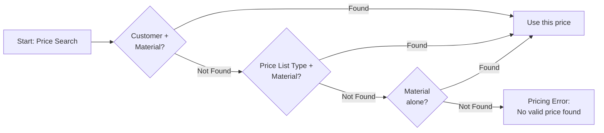

### 12.5 Pricing Procedure Determination

The correct pricing procedure is automatically assigned to a sales document by SAP based on the combination of:

1. **Sales Area** (Sales Organization + Distribution Channel + Division)
2. **Customer Pricing Procedure** (a field on the customer master — e.g., "1" for Standard Customer)
3. **Document Pricing Procedure** (a field on the sales order type — e.g., "A" for Standard Order)

| Sales Area | Customer Pricing Procedure | Document Pricing Procedure | Assigned Pricing Procedure |
|------------|---------------------------|---------------------------|---------------------------|
| Any Galana Sales Area | 1 (Standard) | A (Standard Order) | ZVGALE (Galana Standard) |
| Any Galana Sales Area | 2 (Export) | A (Standard Order) | ZVGALX (Galana Export) |
| Inter-Company | IC (Inter-Company) | A | ZVGALIC (Galana Inter-Co) |

### 12.6 Price Maintenance Process

**Who can maintain prices?**
- Pricing condition records (PR00) are maintained by the Pricing Master Data team.
- Customer discount records (K007) require Sales Manager approval.
- Regulated prices (ZEDT, ZREG) are maintained by the Finance team upon receipt of official government notifications.

**How prices are maintained:**
- Transaction VK11 (Create Condition Records)
- Transaction VK12 (Change Condition Records)
- Transaction VK13 (Display Condition Records)

**Validity Periods:**
- All condition records must have a defined validity period (From Date and To Date).
- It is a business rule that no condition record may be created with an open-ended validity (no To Date) without Finance Controller approval.
- When a regulated price changes, the old condition record is end-dated and a new record is created with the new rate effective from the government's effective date.

### 12.7 Manual Price Override Controls

> **Critical Business Rule**: Manual price overrides on sales order line items are controlled by SAP user authorization. Only designated users with the appropriate authorization object (V_KONH_VKO or equivalent) may manually override a system-determined price. All manual overrides must be documented with a reason code.

The following price override scenarios are approved:

| Scenario | Approver | Documentation Required |
|----------|----------|----------------------|
| Spot price for one-time customer | Sales Director | Email approval attached to order |
| Price correction due to system error | Pricing Manager | SAP change document + incident log |
| Inter-company transfer price adjustment | Finance Controller | Inter-company pricing memo |

---

## 13. Customer Master Data

### 13.1 Customer Master Overview

The Customer Master in SAP is the central repository of all information about Galana's customers. It is structured in three levels:

1. **General Data (Client Level)**: Information valid across all company codes and sales areas — name, address, communication details, bank details.
2. **Company Code Data**: Financial accounting information — reconciliation account, payment terms, dunning procedure, credit limit.
3. **Sales Area Data**: Sales-specific information — sales district, price group, pricing procedure, output determination, shipping conditions, incoterms, delivery priority.

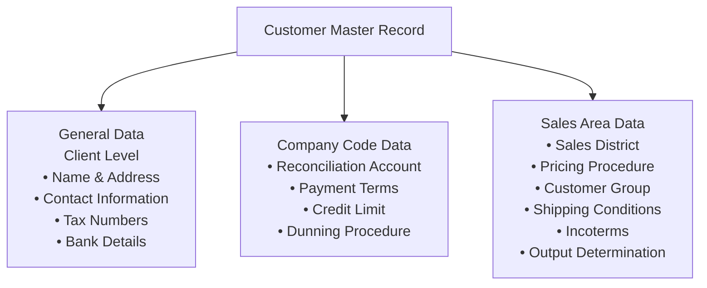

### 13.2 Customer Account Groups

Account Groups in SAP control which fields are displayed, required, or optional on the customer master. They also determine the number range for customer numbers.

| Account Group | Code | Description | Number Range | Notes |
|---------------|------|-------------|--------------|-------|
| Sold-To Party | 0001 | Customer who places the order | Internal (auto-assigned) | Main customer type |
| Ship-To Party | 0002 | Customer who receives delivery | Internal | Can be same as sold-to |
| Bill-To Party | 0003 | Customer who receives invoice | Internal | Can be same as sold-to |
| Payer | 0004 | Customer who pays | Internal | Can be same as sold-to |
| One-Time Customer | CPD | Occasional/walk-in customer | Internal | Used for cash sales |
| Inter-Company Customer | ZICO | Customer representing a Galana entity | Internal | Auto-created via inter-co config |

> **Business Rule**: For most Galana customers, the same business entity will be both the Sold-To, Ship-To, Bill-To, and Payer. However, in cases where a customer has a different billing address or where an agent pays on behalf of the customer, the partner functions must be configured correctly to reflect this.

### 13.3 Customer Master — Required Fields

The following fields must be completed for all new customer master records:

#### General Data (Mandatory)

| Field | Description | Notes |
|-------|-------------|-------|
| Name 1 | Legal registered name of customer | Must match trade registration |
| Name 2 | Trading name (if different) | |
| Street / House No. | Physical address | |
| City | City of customer's registered address | |
| Country | Country code | Determines tax and currency defaults |
| Language | Communication language | |
| Tax Number 1 | VAT registration number | Mandatory for VAT customers |
| Tax Number 2 | Other tax reference (e.g., PIN, TIN) | Country-specific |

#### Company Code Data (Mandatory)

| Field | Description | Notes |
|-------|-------------|-------|
| Reconciliation Account | G/L reconciliation account for AR | Assigned by Finance |
| Sort Key | Determines how line items are sorted in FI | |
| Payment Terms | Default payment terms | E.g., NET30, NET60 |
| Tolerance Group | Defines acceptable payment difference | |

#### Sales Area Data (Mandatory)

| Field | Description | Notes |
|-------|-------------|-------|
| Sales District | Geographic sales area | For reporting/commission |
| Customer Group | Commercial customer classification | Used in pricing |
| Price Group | Price list assignment | Determines base price access |
| Customer Pricing Procedure | Pricing procedure determination | |
| Shipping Conditions | Mode and priority of shipping | E.g., standard, express |
| Delivery Priority | Order of fulfillment | |
| Incoterms | Delivery terms | E.g., EXW, CIF, FOB |
| Output (Invoice) | Invoice output type and medium | Print or electronic |
| Tax Classification | Customer tax status | 0 = not liable, 1 = liable |

### 13.4 Customer Master Data Creation Process

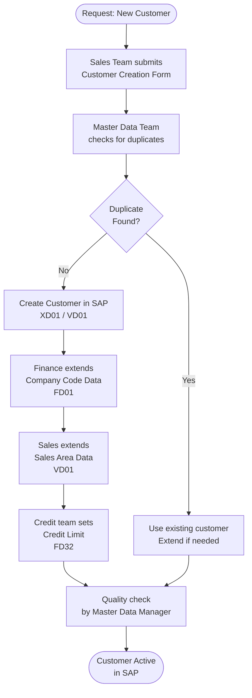

### 13.5 Partner Function Determination

Partner functions define the roles a customer plays in a transaction. SAP automatically determines partner functions based on the Sold-To Party:

| Partner Function | Code | Description | Automatic Source |
|-----------------|------|-------------|-----------------|
| Sold-To Party | AG | Places the order | Entered manually |
| Ship-To Party | WE | Receives delivery | From sold-to customer master |
| Bill-To Party | RE | Receives invoice | From sold-to customer master |
| Payer | RG | Makes payment | From sold-to customer master |
| Sales Employee | VE | Responsible sales rep | From user master / org assignment |
| Contact Person | AP | Customer contact | From customer master contacts |

### 13.6 Customer-Material Info Record

The Customer-Material Information Record (Transaction VD51/VD52) stores customer-specific material information:

- Customer's own material number or description (customer material number)
- Preferred delivering plant for this customer-material combination
- Customer-specific partial delivery agreement
- Minimum order quantity

> **Business Rule**: When a customer uses their own material/product codes on purchase orders, the customer-material info record must be maintained so SAP can automatically translate the customer's code to the correct Galana material number during sales order entry.

---

## 14. Material Master Data (SD View)

### 14.1 Material Master SD Views

The Material Master in SAP stores all product-related data. For SD processes, the following views are relevant:

| View | Key Fields | Maintained By |
|------|-----------|---------------|
| Sales: Sales Org 1 | Sales Unit, Material Group, Delivering Plant, Sales Conditions | SD Master Data Team |
| Sales: Sales Org 2 | Tax Classification, Item Category Group, Material Pricing Group | SD Master Data Team |
| Sales: General/Plant Data | Availability check type, Batch management indicator, Loading Group | SD / MM Teams |
| MRP 1-4 Views | Planning data | MM / Planning Team |

### 14.2 Key SD Fields on Material Master

| Field | Description | Business Meaning |
|-------|-------------|-----------------|
| Sales Unit (VRKME) | Unit in which material is sold | E.g., L (Litres), KL (Kilolitres), MT (Metric Tonnes) |
| Material Group (MATKL) | Grouping of materials | Used in pricing access sequences |
| Delivering Plant | Default plant for deliveries | Can be overridden at order level |
| Item Category Group (ITMGR) | Determines item category on sales order | NORM = Standard item, BANS = Third party |
| Tax Classification | Material's tax status | 0 = not taxable, 1 = taxable |
| Sales Conditions | Minimum order quantity, minimum delivery quantity | Business-agreed minimum volumes |
| Loading Group | How material is loaded | Determines shipping point |

### 14.3 Material Types for Petroleum Products

| Material Type | Code | Description |
|---------------|------|-------------|
| Finished Goods | FERT | Saleable petroleum products (Diesel, Petrol, etc.) |
| Trading Goods | HAWA | Purchased and resold goods (Lubricants from external suppliers) |
| Non-Valuated Material | NLAG | Non-stock items sold to customers |
| Service | DIEN | Service items (if applicable) |

---

## 15. Delivery and Shipping Processing

### 15.1 Outbound Delivery Overview

An Outbound Delivery in SAP is the document that triggers the physical movement of goods from Galana's facilities to the customer. Key points:

- A delivery is always created with reference to a sales order.
- A delivery can contain items from multiple sales orders (collective delivery).
- Multiple deliveries can reference a single sales order (partial deliveries).
- Goods Issue (GI) posting on the delivery reduces inventory and triggers the accounting entry.

### 15.2 Delivery Process Flow

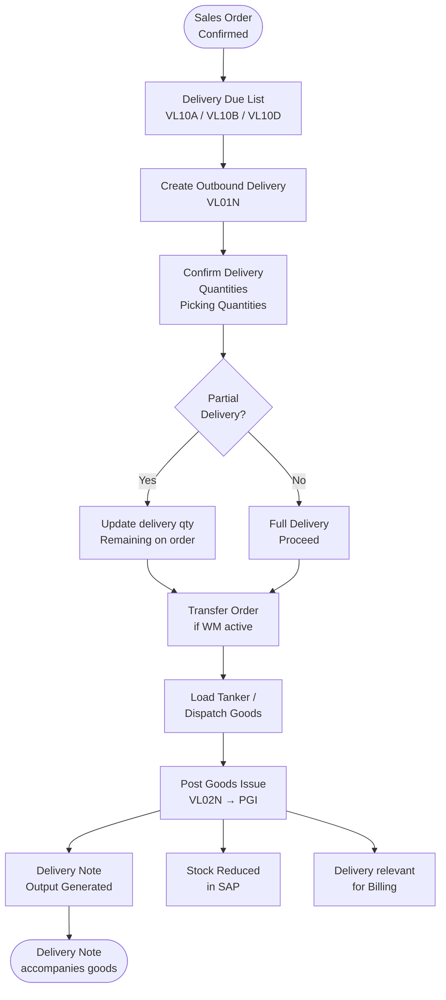

### 15.3 Partial Deliveries

Galana's customer master records define the partial delivery agreement per customer:

| Partial Delivery Indicator | Meaning |
|---------------------------|---------|
| A | Only complete delivery allowed (all items or none) |
| B | Partial delivery allowed — first delivery as soon as possible |
| C | Partial delivery allowed — all items together |
| D | Partial delivery allowed — complete open quantity in one delivery |

> **Business Rule**: For customers with strict full-delivery requirements (e.g., government bulk purchase contracts), the partial delivery indicator must be set to "A" on the customer master to prevent partial deliveries from being dispatched.

### 15.4 Goods Issue — Business and Accounting Impact

The Goods Issue (GI) posting is a critical step. When GI is posted:

1. **Stock is reduced** in the inventory management (MM) module.
2. **Cost of Goods Sold (COGS)** accounting entry is created in FI:
   - Dr: Cost of Goods Sold (P&L account)
   - Cr: Finished Goods Inventory (B/S account)
3. The delivery becomes **relevant for billing** — an invoice can now be created.
4. A **goods movement document** is created in MM (Material Document).
5. A **financial accounting document** is created in FI.

> **Business Rule**: Goods Issue must only be posted after the goods have physically left the facility (tanker loaded and departed gate). Posting GI before physical dispatch is a financial control violation.

### 15.5 Delivery-Relevant Settings

#### Shipping Conditions (Customer Master)

The Shipping Condition on the customer master influences how deliveries are scheduled and which shipping point is proposed:

| Shipping Condition | Description |
|--------------------|-------------|
| 01 | Standard Delivery |
| 02 | Express / Rush Delivery |
| 03 | Customer Pickup (EXW — customer collects) |
| 04 | Tanker Delivery (bulk liquid by road tanker) |
| 05 | Pipeline Delivery (where pipeline infrastructure exists) |

#### Loading Groups (Material Master)

| Loading Group | Description |
|---------------|-------------|
| 0001 | Bulk Liquid (tanker loading) |
| 0002 | Drummed / Packaged Goods |
| 0003 | LPG (cylinder or bulk) |

### 15.6 Route Determination

Routes define the path from the shipping point to the customer's location and impact delivery scheduling (transit time, transportation time).

**Route determination factors:**
- Shipping Point (departure point)
- Transportation Zone of the destination
- Shipping Condition
- Weight / Volume group of material

> **Business Rule**: Routes and transit times must be correctly maintained so that the system accurately calculates the earliest possible delivery date (considering transportation lead time, loading time, and pick/pack time). Incorrect route maintenance will cause ATP dates to be incorrect.

### 15.7 Proof of Delivery (POD)

In the petroleum distribution industry, Proof of Delivery (POD) is a critical business and financial control. The following POD process applies:

1. Driver dispatched with signed delivery note.
2. Customer signs delivery note confirming receipt of specified quantity.
3. Signed delivery note returned to Galana.
4. Billing may only proceed after POD confirmation (if POD-relevant billing is activated in system).
5. Discrepancies between delivered and ordered quantities are resolved via a quantity adjustment process before billing.

> **Business Rule for POD**: Where the customer-measured quantity (metered delivery) differs from the bill of lading quantity, the lower of the two quantities should be used for billing, unless a separate quantity reconciliation process is completed.

---

## 16. Billing and Invoicing

### 16.1 Billing Overview

Billing is the process of creating a formal invoice (or other billing document) to request payment from the customer. In SAP SD, billing is always the final step in the OTC document chain.

**Key Billing Principles at Galana:**
- Billing is always based on the goods-issued delivery (goods must be physically dispatched before billing).
- The billing quantity equals the goods issued quantity (not the originally ordered quantity).
- Billing must be completed within 24 hours of goods issue (business SLA).
- All billing documents are automatically transferred to SAP FI (Accounts Receivable) upon saving.

### 16.2 Billing Document Types

| Billing Type | Description | Reference Document | Business Use |
|--------------|-------------|-------------------|-------------|
| F2 | Standard Invoice | Outbound Delivery | Standard customer invoice |
| F1 | Order-Related Invoice | Sales Order | For service items not delivery-relevant |
| G2 | Credit Memo | Credit Memo Request (CR) | Credits to customer |
| L2 | Debit Memo | Debit Memo Request (DR) | Additional charges to customer |
| RE | Returns Credit | Returns Delivery | Credit for returned goods |
| F8 | Pro-Forma Invoice | Sales Order or Delivery | Non-posting invoice (export docs, LC) |
| IV | Inter-Company Invoice | Inter-Co Sales Order | Invoice from selling entity to buying entity |
| IG | Inter-Company Credit Memo | Inter-Co Credit Memo Request | Credit in inter-company process |

### 16.3 Billing Due List Process

The **Billing Due List** (Transaction VF04) is the standard mechanism for processing multiple billing documents efficiently:

1. Billing Clerk runs VF04 (Billing Due List).
2. Selects billing documents based on:
   - Billing Date range
   - Sales Organization
   - Billing Type
   - Individual customer or all customers
3. System displays all delivery documents ready for billing.
4. Billing Clerk selects all (or a subset) and initiates collective billing.
5. SAP creates invoices for all selected deliveries.
6. Error log is reviewed — any failed items are investigated and corrected.
7. Invoice output is triggered (printing or electronic delivery).

### 16.4 Billing Process Flow

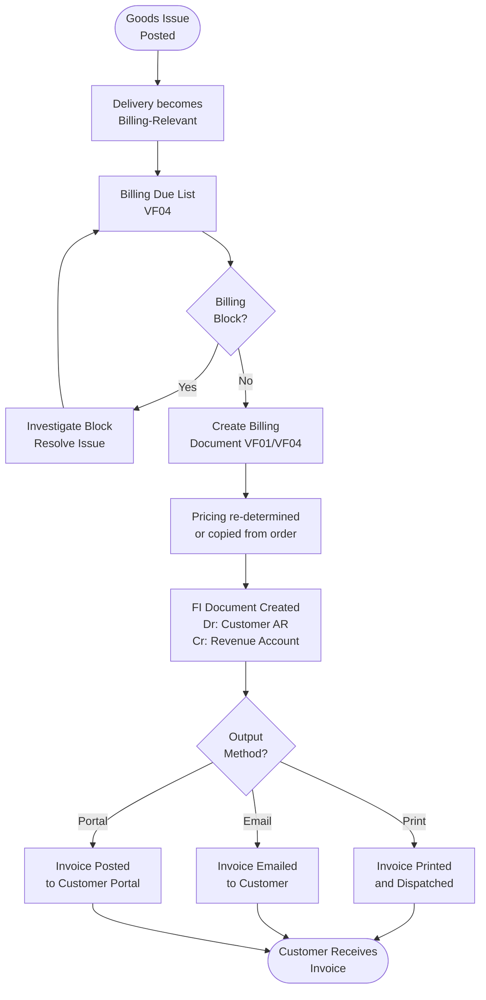

### 16.5 Revenue Account Determination

SAP automatically determines the G/L revenue accounts for each billing line item using Account Determination (Transaction VKOA). The determination uses:

- **Application**: V (Sales/Distribution)
- **Condition Table**: Combination of Sales Organization + Distribution Channel + Division + Account Assignment Group (customer) + Account Assignment Group (material)

| Account Assignment Group (Customer) | Account Assignment Group (Material) | Revenue Account | Description |
|--------------------------------------|--------------------------------------|-----------------|-------------|
| 01 (Domestic Customer) | 01 (Petroleum Products) | 4XXXXXX | Domestic Petroleum Revenue |
| 01 (Domestic Customer) | 02 (Lubricants) | 4XXXXXX | Domestic Lubricants Revenue |
| 02 (Export Customer) | 01 (Petroleum Products) | 4XXXXXX | Export Petroleum Revenue |
| IC (Inter-Company Customer) | 01 (Petroleum Products) | 4XXXXXX | Inter-Company Revenue |

> **Note**: Actual G/L account numbers to be confirmed by Finance Controller. The above structure must be aligned with the SAP FI/CO Chart of Accounts BBP.

### 16.6 Billing Blocks

Billing Blocks prevent a delivery or order from being invoiced until the block is manually removed. Billing blocks may be applied:

- **Automatically**: System applies a billing block based on configuration (e.g., new customer pending credit limit approval, POD pending).
- **Manually**: A user applies a billing block to investigate a pricing or quantity discrepancy.

| Billing Block Code | Description | Who Removes |
|--------------------|-------------|-------------|
| 01 | Credit Memo to be checked | Credit Manager |
| 02 | Check Quantity | Billing Clerk / Warehouse |
| 03 | POD Pending | Logistics Coordinator |
| 08 | Blocking reason: Price discrepancy | Pricing Manager |
| Z1 | Management Approval Required | Sales Director |

> **Business Rule**: A Billing Block must never remain unresolved for more than 48 hours. The Billing Clerk is responsible for monitoring the Billing Due List and escalating unresolved blocks.

### 16.7 Credit Memo and Debit Memo Process

**Credit Memo Process (issuing money back to customer):**

1. Trigger: Customer disputes invoice (quantity, price, product quality issue), or a pricing correction is needed.
2. Sales team / Customer Service creates a **Credit Memo Request** (order type CR) in VA01 with reference to the original invoice.
3. The Credit Memo Request is subject to **approval workflow** (see Section 25).
4. Once approved, the billing clerk creates the **Credit Memo** (billing type G2) from the Credit Memo Request.
5. Credit Memo posts to FI:
   - Dr: Revenue account (reversed)
   - Cr: Customer AR (reduced)
6. Credit Memo output is sent to customer.

**Debit Memo Process (additional charge to customer):**

1. Trigger: Underbilling, retrospective price increase, or additional service charge.
2. Sales team creates a **Debit Memo Request** (order type DR) in VA01.
3. Subject to approval workflow.
4. Billing Clerk creates **Debit Memo** (billing type L2).
5. Debit Memo posts to FI:
   - Dr: Customer AR (increased)
   - Cr: Revenue account

---

## 17. Credit Management

### 17.1 Credit Management Overview

Credit Management is a critical financial control at Galana, given the high value of petroleum product transactions and the credit risk exposure associated with large commercial customers. SAP SD credit management is integrated with SAP FI (Financial Accounting) — specifically with the Credit Management function within Accounts Receivable.

**SAP Credit Management Integration:**
- Credit limits are maintained in SAP FI (Transaction FD32).
- Credit exposure is calculated in real time by SAP during sales order creation.
- Credit blocks are automatically applied to sales orders when a customer's credit exposure exceeds their credit limit.
- Credit blocks must be manually released by an authorized Credit Manager.

### 17.2 Credit Exposure Components

SAP calculates a customer's total credit exposure as the sum of:

| Component | Description |
|-----------|-------------|
| Open Sales Orders | Value of confirmed sales orders not yet delivered |
| Open Deliveries | Value of goods-issued deliveries not yet billed |
| Open Billing Documents | Value of billed invoices not yet transferred to FI (rare) |
| Open Items in FI | Unpaid customer invoices in Accounts Receivable |

The total credit exposure is compared against the customer's credit limit. If exposure ≥ credit limit, the system may apply a credit block.

### 17.3 Credit Check Types

| Credit Check Type | Code | Description |
|------------------|------|-------------|
| Static Credit Check | A | Simple comparison of total exposure against credit limit |
| Dynamic Credit Check | B | Comparison of horizon (e.g., 90-day) of open items + orders against credit limit |
| Combination | C | Both static and dynamic checks applied |

**Galana Standard**: Static credit check (Type A) to be used as the baseline. The exact credit check type will be confirmed by the Finance Controller.

### 17.4 Credit Check Timing

SAP can perform credit checks at multiple points in the sales process:

| Check Point | When | Purpose |
|-------------|------|---------|
| Sales Order Creation | VA01 save | First check before order is confirmed |
| Sales Order Change | VA02 save | Re-check if quantity or value increases |
| Delivery Creation | VL01N | Check before goods are dispatched |
| Goods Issue | Post GI | Final check before stock leaves facility |

> **Business Rule**: The credit check must be active at Sales Order Creation as the minimum. Galana may also choose to activate the delivery-level check as a secondary control. The Goods Issue check is recommended for high-risk customer segments.

### 17.5 Credit Limit Management Process

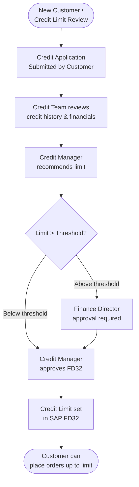

### 17.6 Credit Block and Release Workflow

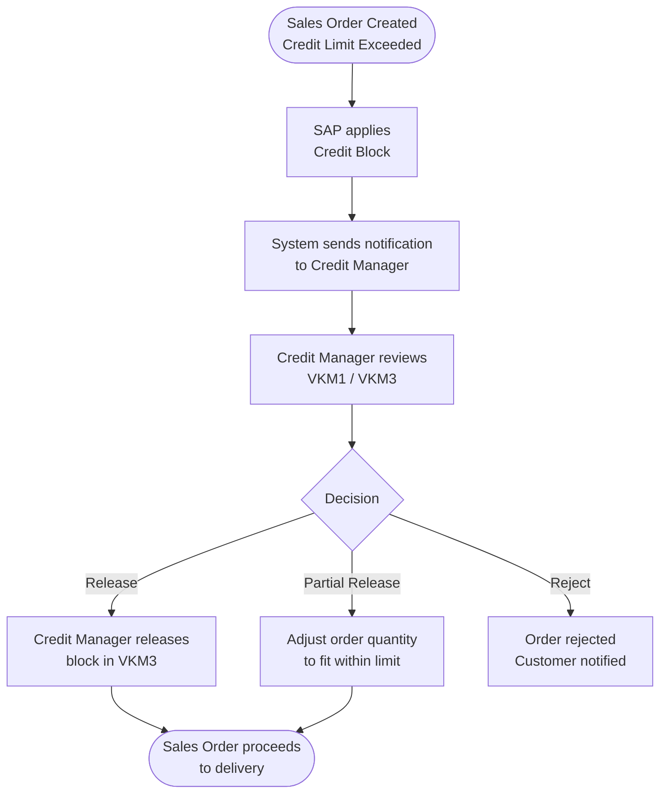

### 17.7 Credit Risk Categories

Customers may be assigned to credit risk categories that determine the sensitivity of the credit check:

| Risk Category | Description | Check Behavior |
|---------------|-------------|---------------|
| 001 | Low Risk | Check only at order level |
| 002 | Medium Risk | Check at order and delivery level |
| 003 | High Risk | Check at order, delivery, and GI level |
| 000 | No Check | Credit check bypassed (internal/inter-company) |

---

## 18. Returns and Complaints Management

### 18.1 Returns Process Overview

Customer returns at Galana may occur due to:
- Product quality issues (contaminated fuel, off-spec product)
- Incorrect product delivered (wrong grade, wrong product)
- Quantity discrepancy (less than invoiced quantity delivered)
- Delivery to wrong location

> **Business Rule**: No credit may be issued to a customer for a product return without physical verification of the returned goods (or formal quality test results for quality claims). Exceptions require Finance Director approval.

### 18.2 Returns Process Flow

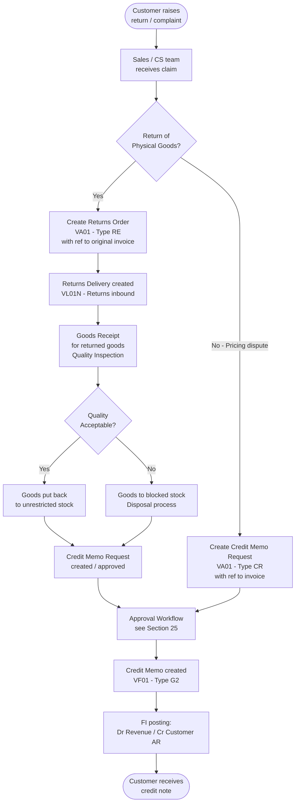

### 18.3 Returns Order (RE) — Configuration

| Parameter | Setting |
|-----------|---------|
| Order Type | RE |
| Billing Type | RE (Returns) → G2 (Credit Memo) |
| Credit Check | Active (return must not exceed credit limit) |
| Delivery Type | LR (Returns Delivery) |
| Movement Type | 651 (Returns from Customer to Plant — unrestricted stock) or 655 (to blocked stock) |
| Item Category | REN (with credit) |

### 18.4 Complaints and Subsequent Delivery Processing

For minor complaints where a replacement delivery is provided (rather than a credit), the following process applies:

1. **Subsequent Delivery Free-of-Charge**: Order type SDF (or equivalent) — creates a zero-value delivery to replace the disputed quantity. The cost is absorbed by Galana.
2. **Subsequent Debit**: Where additional quantities were delivered above the invoiced amount (discovered later), a Debit Memo Request (DR) is raised.

---

## 19. Inter-Company Sales

### 19.1 Inter-Company Process Overview

Inter-Company sales at Galana occur when one Galana legal entity (the **Ordering Company** / buying entity) purchases products from another Galana legal entity (the **Supplying Company** / selling entity). This is common when one country's entity sources products from another country's terminal.

**Key Principle**: In SAP, the inter-company process generates two billing documents:
1. **Customer Invoice** (F2): Billing from Selling Entity to the External Customer (if the goods ultimately go to an external customer).
2. **Inter-Company Invoice** (IV): Billing from Supplying Entity to Ordering Entity at the transfer price.

### 19.2 Inter-Company Process Flow

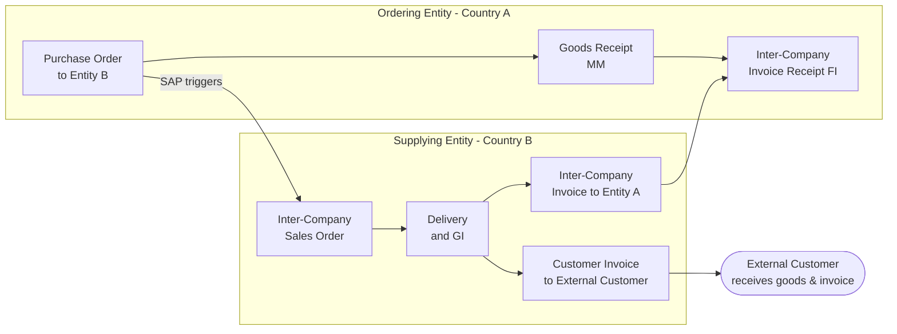

### 19.3 Inter-Company Configuration Requirements

| Element | Setting |
|---------|---------|
| Ordering Company's Customer Master | An internal customer must be created in the Supplying Entity's system representing the Ordering Entity |
| Inter-Company Billing Type | IV (Internal Billing) |
| Transfer Price | Defined via inter-company pricing condition (PI01 — % of net invoice value, or PI02 — fixed amount) |
| Automatic IV Creation | IV is created automatically when the Supplying Entity posts goods issue |
| Invoice Output | IV is typically not sent externally — for internal reconciliation only |
| Tax Treatment | Inter-company transactions may be subject to different tax rules — to be confirmed by Tax team |

### 19.4 Inter-Company Transfer Pricing

The transfer price (price at which one Galana entity sells to another) is defined as:

- A percentage of the customer's net invoice value (PI01 condition type), OR
- A fixed price per unit maintained in inter-company condition records

> **Business Rule**: Inter-company transfer prices must be reviewed and approved by the Group Finance Director on an annual basis or when market conditions change significantly. Transfer prices that deviate from the approved structure require specific authorization.

---

## 20. Third-Party / Drop-Shipment Processing

### 20.1 Third-Party Process Overview

Third-Party Processing (also known as Drop-Shipment) is used when Galana sells products to a customer but the goods are physically fulfilled by a third-party vendor directly to the customer. Galana acts as a commercial intermediary.

**When Used at Galana:**
- Supply of products from third-party refineries or terminals directly to customer sites.
- Temporary supply arrangements when Galana's own stock is insufficient.

### 20.2 Third-Party Process Flow

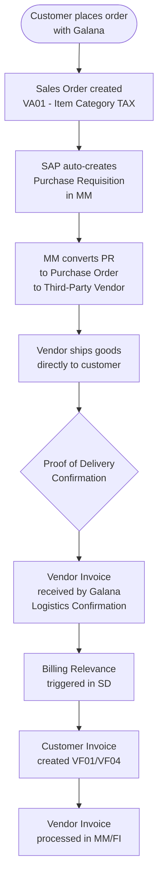

### 20.3 Third-Party Configuration

| Parameter | Setting |
|-----------|---------|
| Item Category | TAX (Third-Party) |
| Item Category Group on Material | BANS |
| Schedule Line Category | CS (creates Purchase Requisition) |
| Billing Relevance | E (Billing based on Goods Receipt/Vendor Invoice confirmation) |
| Delivery | No outbound delivery created — no stock movement in Galana plants |
| Purchase Requisition | Auto-generated at sales order creation |

> **Business Rule**: Third-party orders must always be created with reference to a formal vendor agreement or spot purchase authorization. The price paid to the vendor and the price charged to the customer must both be recorded transparently to ensure the gross margin is visible.

---

## 21. Contract and Scheduling Agreement Management

### 21.1 Quantity and Value Contracts

Galana uses SAP Contracts to formalize long-term supply arrangements with key customers. A contract defines:
- The total agreed quantity (Quantity Contract) OR total agreed value (Value Contract)
- The validity period
- The pricing applicable to releases

**Contract Types Used:**

| Contract Type | Code | Description |
|---------------|------|-------------|
| Quantity Contract | MK | Agreement to supply a total quantity over a period |
| Value Contract | WK1 / WK2 | Agreement to supply up to a total value over a period |

**Contract Release Process:**

1. Sales team creates a release order (standard sales order) referencing the contract number.
2. SAP copies pricing from the contract.
3. The released quantity / value is deducted from the contract's remaining balance.
4. When the contract balance reaches zero, no further releases are permitted unless the contract is amended.

### 21.2 Scheduling Agreements

A Scheduling Agreement is a long-term arrangement with a customer that includes a delivery schedule (specific delivery dates and quantities within the agreement period).

**Used For:**
- Government supply contracts with fixed monthly delivery schedules.
- Large industrial customers with regular, predictable demand.

**Process:**
1. Scheduling Agreement header created (SA type LZ or equivalent).
2. Delivery schedule lines are entered or updated periodically.
3. SAP creates delivery schedule lines that are used to create outbound deliveries.

---

## 22. Output and Forms Management

### 22.1 Output Types Overview

SAP Output Management controls when and how business documents are communicated to customers and internal stakeholders. The following output types are required for Galana's SD processes:

| Output Type | Description | Trigger | Medium | Recipient |
|-------------|-------------|---------|--------|-----------|
| BA00 | Order Confirmation | Sales Order creation | Print / Email | Customer |
| LD00 | Delivery Note | Goods Issue | Print | Driver / Customer |
| RD00 | Invoice / Billing Output | Billing document creation | Print / Email | Customer |
| RD01 | Credit Memo Output | Credit Memo creation | Print / Email | Customer |
| RD02 | Debit Memo Output | Debit Memo creation | Print / Email | Customer |
| LR00 | Pro-Forma Invoice | Pro-Forma billing | Print / Email | Customer (for LC/Export) |
| ZICO | Inter-Company Invoice | IV billing document | Print / Email | Internal (Ordering Entity) |

### 22.2 Output Determination

SAP output determination uses the same condition technique as pricing. For each output type, condition records define:
- **When**: Which customers or document types trigger the output.
- **How**: The print medium (print, email, fax, EDI).
- **When to send**: Immediately on save, or at a specific time.

### 22.3 Invoice (RD00) — Form Requirements

The SAP invoice output must include the following business information (as required by Galana business and local tax regulations):

| # | Field | Description |
|---|-------|-------------|
| 1 | Galana Legal Entity Name | Registered company name of billing entity |
| 2 | Galana Tax Registration Number | VAT/Tax registration of billing entity |
| 3 | Invoice Number | Unique SAP billing document number |
| 4 | Invoice Date | Date of billing document creation |
| 5 | Customer Name and Address | Sold-to / Bill-to party details |
| 6 | Customer Tax Number | Customer's VAT registration |
| 7 | Delivery Note Reference | Delivery document number |
| 8 | Purchase Order Reference | Customer's PO number |
| 9 | Material Description | Product name and grade |
| 10 | Quantity and Unit of Measure | Quantity delivered (e.g., 50,000 litres) |
| 11 | Unit Price | Price per unit of measure |
| 12 | Net Value | Quantity × Unit Price |
| 13 | Discounts / Surcharges | Itemized breakdown |
| 14 | Excise Duty / Fuel Levy | Amount and rate per unit |
| 15 | VAT Amount | Tax amount |
| 16 | Gross Invoice Value | Total amount due including taxes |
| 17 | Payment Terms | Due date for payment |
| 18 | Bank Details | Galana's bank account for payment |
| 19 | Authorised Signatory | Printed name of authorised person |

> **Business Rule**: Invoices must comply with the local VAT/tax invoice requirements of each country of operation. The Finance and Tax teams must sign off on the final invoice form design before Go-Live.

### 22.4 Delivery Note (LD00) — Form Requirements

The delivery note accompanies goods during transportation and serves as the transport document and proof of delivery:

| # | Field | Description |
|---|-------|-------------|
| 1 | Delivery Note Number | SAP delivery document number |
| 2 | Date of Issue | Date delivery note printed |
| 3 | Selling Entity Name | Galana entity name |
| 4 | Ship-From Address | Plant / terminal address |
| 5 | Customer Name | Ship-to party name |
| 6 | Delivery Address | Customer's delivery address |
| 7 | Product Description | Material description |
| 8 | Ordered Quantity | Quantity from sales order |
| 9 | Delivered Quantity | Actual quantity loaded (confirmed at GI) |
| 10 | Vehicle Registration | Transport vehicle plate number |
| 11 | Driver Name | Name of driver |
| 12 | Customer Signature | Space for customer to sign as confirmation |
| 13 | Date/Time of Delivery | Actual delivery datetime |
| 14 | Seal Numbers | Tanker seal numbers for product integrity |

---

## 23. SAP Solution Design Decisions

### 23.1 Key Configuration Decisions

This section documents the key SAP SD configuration decisions that have been agreed upon and will drive system configuration:

| # | Decision Area | Decision Made | Rationale |
|---|---------------|---------------|-----------|
| 1 | Sales Organization Structure | One Sales Organization per country of operation | Reflects legal entity structure and currency requirements |
| 2 | Division Usage | Product divisions used (Fuel, Lubes, LPG, Bitumen) | Enables product-based reporting and division-specific pricing |
| 3 | Cross-Division | Division 00 configured for cross-division customers | Simplifies customer master for customers buying multiple product types |
| 4 | Pricing Procedure | Single standard pricing procedure for domestic sales; separate for export | Minimizes maintenance complexity |
| 5 | Credit Check Type | Static credit check as standard | Simpler to administer; can be upgraded to dynamic post Go-Live |
| 6 | Billing Basis | Billing always based on delivery (GI quantity) | Ensures only dispatched goods are invoiced; financial control |
| 7 | Collective Billing | Multiple deliveries can be combined on one invoice | Per customer request — reduces volume of invoices |
| 8 | Output Medium | Print as primary; email as secondary (where customer email confirmed) | Practical for current operations; email to be rolled out progressively |
| 9 | Partner Function Default | All four partner functions default from sold-to | Standard SAP approach; exceptions handled via customer master |
| 10 | Customer Number Range | Internal number assignment (system-assigned) | Prevents duplicates and gaps in numbering |
| 11 | Material Number Range | Internal number assignment | Consistency with MM design |
| 12 | Rebates | Not activated in current phase | To be reviewed post Go-Live |
| 13 | Batch Management | Aligned with MM BBP decision | SD will consume batches if MM activates batch management |
| 14 | ATP Check | Simple ATP check (check against available stock) | No advanced ATP in scope |
| 15 | POD (Proof of Delivery) | POD activation to be decided per country | Subject to operational readiness per country |

### 23.2 Design Deviations from SAP Standard

| # | Standard SAP Behavior | Galana Deviation / Custom Requirement | Implementation Approach |
|---|----------------------|--------------------------------------|------------------------|
| 1 | Standard invoice form | Galana-specific invoice with excise duty breakdown and local regulatory fields | Custom SmartForm or Adobe Form development |
| 2 | Standard delivery note | Custom delivery note with seal numbers, driver details, vehicle reg | Custom form development |
| 3 | Regulated price update | Manual condition record update | Periodic batch upload of government-set prices (BDC or LSMW) |
| 4 | Credit memo approval | No standard approval in SD | Credit memo request put on billing block; manual release = approval |

---

## 24. Business Rules Repository

This section consolidates all business rules identified across all process areas. Each rule is numbered for reference traceability.

### 24.1 Sales Order Business Rules

| Rule # | Rule Description | Process Area |
|--------|-----------------|--------------|
| BR-SD-001 | A sales order may only be created for a customer with a fully completed customer master record (General Data + Company Code Data + Sales Area Data). | Sales Order Management |
| BR-SD-002 | The correct sales order type must be selected based on the business scenario. Using the wrong order type is not permitted. | Sales Order Management |
| BR-SD-003 | Rush orders must still pass the standard credit check. A rush order does not bypass credit management. | Sales Order Management |
| BR-SD-004 | Customer purchase order number must be entered on all sales orders where the customer provides a PO reference. | Sales Order Management |
| BR-SD-005 | Sales orders must not be changed after goods issue has been posted without Finance Controller approval. | Sales Order Management |
| BR-SD-006 | Open sales orders older than 90 days with no delivery activity must be reviewed and either completed or cancelled. | Sales Order Management |

### 24.2 Pricing Business Rules

| Rule # | Rule Description |
|--------|-----------------|
| BR-PR-001 | Manual price overrides are only permitted for authorized users with documented approval. |
| BR-PR-002 | Regulated prices must be updated in SAP within 24 hours of government notification. |
| BR-PR-003 | All condition records must have a valid To Date (no open-ended records without FC approval). |
| BR-PR-004 | Customer discounts must be authorized by the Sales Manager before creation in SAP. |
| BR-PR-005 | The pricing procedure must result in a non-zero price for all billable items — zero-price items require special approval. |
| BR-PR-006 | Excise duty / fuel levy rates are non-negotiable and apply equally to all customers for the same product. |

### 24.3 Credit Management Business Rules

| Rule # | Rule Description |
|--------|-----------------|
| BR-CR-001 | All customers must have a credit limit set in SAP before their first sales order is created. |
| BR-CR-002 | Credit limit increases require approval as per the defined authority matrix (see Section 25). |
| BR-CR-003 | Credit blocks must be reviewed within 24 hours of application. |
| BR-CR-004 | Credit blocks may only be released by the Credit Manager or Finance Director (no self-release by sales team). |
| BR-CR-005 | Inter-company customers are exempt from credit checks (credit check indicator = no check). |
| BR-CR-006 | The total credit exposure calculation must include open orders + open deliveries + open AR items. |

### 24.4 Delivery and Goods Issue Business Rules

| Rule # | Rule Description |
|--------|-----------------|
| BR-DL-001 | Goods Issue may only be posted after goods have physically left the facility. Premature GI posting is a financial control violation. |
| BR-DL-002 | Delivery quantities must not exceed sales order quantities without specific approval. |
| BR-DL-003 | For full-delivery customers (partial delivery = A), the delivery must contain all items before GI may be posted. |
| BR-DL-004 | A valid delivery note must accompany all physical deliveries. |
| BR-DL-005 | The POD-confirmed quantity, not the shipped quantity, governs billing where POD billing is activated. |

### 24.5 Billing Business Rules

| Rule # | Rule Description |
|--------|-----------------|
| BR-BL-001 | Invoices must only be created after Goods Issue has been posted. No invoice without physical dispatch. |
| BR-BL-002 | The billing quantity must equal the goods issued quantity. |
| BR-BL-003 | The billing SLA is 24 hours from Goods Issue — unresolved billing blocks must be escalated after 48 hours. |
| BR-BL-004 | Credit memos require approval before creation (billing block on credit memo request). |
| BR-BL-005 | Cancelled billing documents must have a cancellation reason documented in the system. |
| BR-BL-006 | Collective invoicing (combining multiple deliveries) is permitted only where the customer has agreed to combined invoicing. |

### 24.6 Returns Business Rules

| Rule # | Rule Description |
|--------|-----------------|
| BR-RT-001 | No credit note may be issued for returned goods without physical verification or formal quality test results. |
| BR-RT-002 | Returns must be created with reference to the original invoice. |
| BR-RT-003 | Returned goods must be inspected by Quality team before being returned to unrestricted stock. |
| BR-RT-004 | Off-spec or contaminated returned goods must be moved to blocked stock pending disposal — they may not be resold. |

---

## 25. Approval Workflows

### 25.1 Approval Authority Matrix — SD Transactions

The following approval matrix defines who must authorize various SD transactions and document types:

| Transaction / Action | Level 1 | Level 2 | Level 3 |
|---------------------|---------|---------|---------|
| Sales order manual price override | Sales Representative | Sales Manager | Sales Director |
| Credit limit increase < USD 50,000 | Credit Officer | Credit Manager | — |
| Credit limit increase USD 50,000–250,000 | Credit Manager | Finance Director | — |
| Credit limit increase > USD 250,000 | Finance Director | CEO / Board | — |
| Credit block release | Credit Manager | Finance Director (if urgent) | — |
| Credit memo < USD 1,000 | Customer Service Rep | Sales Manager | — |
| Credit memo USD 1,000–10,000 | Sales Manager | Finance Controller | — |
| Credit memo > USD 10,000 | Finance Controller | Finance Director | — |
| Delivery note cancellation | Logistics Supervisor | Operations Manager | — |
| Billing document cancellation | Billing Clerk | Finance Controller | — |
| Returns order > USD 5,000 | Sales Manager | Finance Controller | — |
| New customer creation | Master Data Team | Credit Team (credit assessment) | — |
| Contract value > USD 500,000 | Sales Director | Finance Director | CEO |

### 25.2 Credit Memo Approval Process Flow

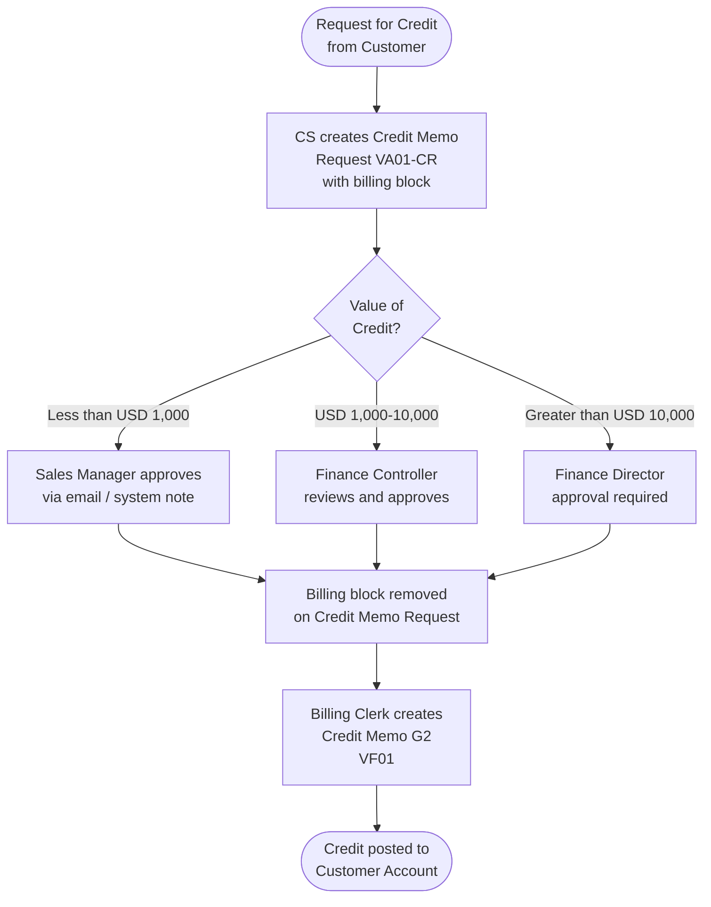

### 25.3 Billing Block as Approval Control

Since SAP GROW Public Cloud has standard approval capabilities, Galana uses the **Billing Block** mechanism as the primary approval control for credit memos:

1. Credit Memo Request is created with a billing block (e.g., Block 01 "Checked by Credit").
2. The approver reviews the credit memo request (VA03 or custom workflow notification).
3. Approver removes the billing block (VA02) — this constitutes approval.
4. Billing Clerk can now invoice (create the credit memo) via VF01.

> **Note on Workflow**: If SAP standard workflow (BRF+, SAP Inbox) is available and configured in the GROW Public Cloud tenant, it should be leveraged for automated routing. If not available, email-based approval with system documentation (via text or status update on the sales document) is the fallback.

---

## 26. Master Data Requirements

### 26.1 Master Data Overview

Master data is the foundation of all SAP transactions. Incorrect or incomplete master data is the leading cause of SAP implementation issues. The following master data objects are in scope for SAP SD:

| Master Data Object | SAP Object | Owner | Key Attributes |
|-------------------|------------|-------|---------------|
| Customer Master | Customers (KNA1/KNB1/KNVV) | Master Data Team + Finance + Sales | Name, address, payment terms, credit limit, sales area data |
| Material Master (SD views) | Materials (MARA/MVKE) | MD Team + Sales | Sales unit, material group, tax classification, item cat group |
| Condition Records (Pricing) | Conditions (KONP/KONH) | Pricing Team + Finance | Price values, validity dates, condition scales |
| Customer-Material Info Record | KNMT | Sales / MD Team | Customer material number, preferred plant |
| Customer Credit Master | Credit (KNKK) | Finance / Credit Team | Credit limit, risk category |
| Output Condition Records | Output conditions | SD Config Team | Output type, medium, timing per customer |
| Routes and Route Determination | Routes | Logistics | Transit times, zones |
| Shipping Point Determination | Config | SD Config | Plant + shipping condition + loading group rules |

### 26.2 Master Data Migration Strategy

At Go-Live, master data must be migrated from legacy systems into SAP. The migration approach:

1. **Extract**: Pull existing customer and material data from legacy systems.
2. **Cleanse**: Remove duplicates, correct incomplete records, standardize formats.
3. **Map**: Map legacy data fields to SAP fields.
4. **Load**: Use SAP data migration tools (LSMW, BAPI, or SAP Data Services) to load into SAP.
5. **Validate**: Verify loaded data for completeness and accuracy.
6. **Approve**: Business sign-off on migrated data quality before Go-Live.

### 26.3 Data Volumes (Estimates)

| Master Data Object | Estimated Volume | Notes |
|-------------------|-----------------|-------|
| Customer Master Records | TBD — to be confirmed during data extraction | Include all active customers from past 3 years |
| Material Master Records (SD views) | TBD | All active saleable materials |
| Pricing Condition Records | TBD | All current price lists, customer discounts |
| Open Sales Orders at Go-Live | TBD — cutover decision needed | Option to create in SAP or manage legacy |
| Open Deliveries at Go-Live | TBD — cutover decision needed | |
| Open AR Items | TBD — managed in FI migration | |

> **Critical Decision Required**: The cutover strategy for open sales orders and open deliveries must be formally decided before the Migration workstream commences. Options are: (a) migrate open documents, (b) close all open documents in legacy before Go-Live, or (c) create balances in FI only.

---

## 27. Integration Requirements

### 27.1 SD Integration with Other SAP Modules

SAP SD is deeply integrated with other SAP modules. The following integration points are in scope:

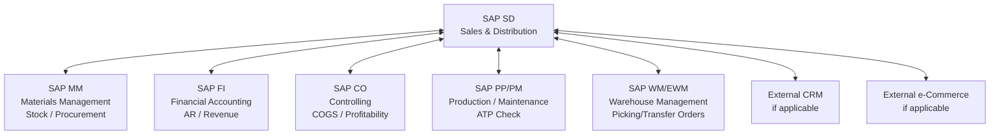

### 27.2 SD — FI Integration (Accounts Receivable)

| Integration Point | Description | Trigger |
|------------------|-------------|---------|
| Billing to AR Posting | Billing document creates open item in customer's AR account | Billing document save |
| Revenue Account Posting | Revenue, excise duty, tax amounts post to correct G/L accounts | Billing document save |
| Credit Management | Credit exposure updated in FI real-time | Sales order creation / GI |
| Payment Terms | Payment terms from customer master FI data used in billing | Sales order / billing |
| Customer Credit Limit | Credit limits maintained in FI and checked by SD | FD32 → SD credit check |

### 27.3 SD — MM Integration (Materials Management)

| Integration Point | Description | Trigger |
|------------------|-------------|---------|
| Availability Check (ATP) | SD checks MM inventory for available stock | Sales order / delivery creation |
| Goods Issue | Delivery GI reduces MM inventory | Post Goods Issue in VL02N |
| Material Master | SD uses MM material master for product information | Real-time read |
| Third-Party PO | SD creates Purchase Requisition → MM converts to PO | Third-party sales order creation |
| Batch Management | If MM activates batch management, SD deliveries will reference batches | Per MM BBP decision |

### 27.4 SD — CO Integration (Controlling)

| Integration Point | Description |
|------------------|-------------|
| Profitability Analysis (PA) | Billing documents post to CO-PA with full characteristic split (customer, material, sales org, etc.) |
| Cost of Goods Sold | GI posting generates COGS entry visible in CO |
| Revenue | Revenue postings flow from FI to CO Cost Center / Profit Center |

### 27.5 External System Integrations

| External System | Integration Type | Data Flow | Priority |
|-----------------|-----------------|-----------|----------|
| Legacy ERP / Order Management | Data Migration only (one-time) | Historical master data and open items → SAP | Critical for Go-Live |
| Government Fuel Price System | Manual data entry + periodic update | Regulated prices → SAP condition records | High (manual process) |
| Customer EDI (if applicable) | IDOC / API | Customer purchase orders → SAP sales orders | TBD — per customer |
| Bank Systems | Via SAP FI (not SD) | Payment receipts → Customer AR clearing | FI scope |
| Reporting / BI | SAP embedded analytics or BW | SAP data → Dashboards/Reports | Post Go-Live phase |

---

## 28. Reporting Requirements

### 28.1 Standard SAP SD Reports

The following standard SAP SD reports will be available post Go-Live:

| Report | Transaction | Description |
|--------|-------------|-------------|
| Sales Order List | VA05 | List of all sales orders by selection criteria |
| Delivery List | VL06 | List of outbound deliveries by status |
| Billing Document List | VF05 | List of billing documents |
| Credit Limit Overview | FD33 | Customer credit limit and exposure |
| Incomplete Sales Orders | V.02 | Sales orders with missing required data |
| Backorder Processing | V_V2 | Orders with insufficient stock |
| Pricing Report | V/LD | Display pricing details for a document |
| Customer Analysis | MCTA | Customer sales analysis |
| Material Analysis | MCTE | Material sales analysis |
| Sales Organization Analysis | MCTS | Sales organization performance |

### 28.2 Custom / Key Operational Reports Required

The following custom or enhanced reports have been identified as business-critical:

| # | Report Name | Description | Key Fields | Priority |
|---|-------------|-------------|-----------|----------|
| R-SD-01 | Daily Sales Volume Report | Total volumes sold by product, customer, plant per day | Date, Plant, Material, Customer, Qty, Value | High |
| R-SD-02 | Open Orders Report | All undelivered sales orders — volume and value | Order No, Customer, Material, Open Qty, Promised Date | High |
| R-SD-03 | Delivery Performance Report | On-time delivery rate vs promised delivery date | Order No, Promised Date, Actual GI Date, Variance | High |
| R-SD-04 | Billing Backlog Report | All deliveries pending billing | Delivery No, GI Date, Customer, Value, Days Since GI | High |
| R-SD-05 | Customer Outstanding Balances | Current customer AR balances by aging bucket | Customer, Invoice No, Due Date, Amount, Days Overdue | High |
| R-SD-06 | Pricing Exceptions Report | Orders where manual price override was applied | Order No, Material, Standard Price, Override Price, User | Medium |
| R-SD-07 | Returns and Credits Report | All credit memos issued in period | Credit Memo No, Customer, Amount, Reason, Approver | Medium |
| R-SD-08 | Inter-Company Sales Report | All inter-company transactions by period | Selling Entity, Buying Entity, Product, Qty, Transfer Price | Medium |
| R-SD-09 | Credit Block Report | All orders currently on credit block | Order No, Customer, Block Date, Exposure vs Limit | High |
| R-SD-10 | Sales Forecast vs Actual | Contracted/scheduled quantities vs actual delivered | Customer, Contract No, Period, Contracted Qty, Actual Qty | Medium |

### 28.3 Management Dashboard Requirements

The following key metrics must be visible on a real-time management dashboard (to be implemented via SAP embedded analytics or SAP Analytics Cloud):

| KPI | Description | Frequency |
|-----|-------------|-----------|
| Daily Sales Volume (Litres / KL) | Total volume dispatched per day | Daily |
| Revenue (by Sales Org / Product) | Gross revenue by organization and product category | Daily |
| Average Delivery Cycle Time | Time from order to GI | Weekly |
| Credit Exposure % | Total exposure as % of total credit limits granted | Daily |
| Overdue AR | Value of overdue invoices | Daily |
| Billing Backlog | Value of unbilled delivered goods | Daily |
| Returns Rate | Returns as % of total sales value | Monthly |
| Top 10 Customers by Volume | Ranking of customers | Weekly |

---

## 29. Security and Authorization Considerations

### 29.1 Authorization Concept Overview

SAP authorization controls which transactions and data objects each user can access. The authorization concept for SAP SD at Galana must align with:

- **Segregation of Duties (SOD)**: No single user should be able to complete a full financial cycle without another person's involvement.
- **Minimum Necessary Access**: Users should only have access to the transactions and organizational objects relevant to their job role.
- **Country / Sales Organization Restrictions**: Users from Country A should not be able to view or process transactions belonging to Country B's sales organization.

### 29.2 Key Segregation of Duties Rules for SD

| SOD Conflict | Incompatible Roles | Risk |
|-------------|-------------------|------|
| Create sales order AND release credit block | Sales Rep + Credit Manager | Sales rep bypasses credit control |
| Create credit memo request AND release billing block | CS Agent + Billing Clerk | Unapproved credits issued |
| Create customer master AND create sales order | MD Team + Sales Rep | Fictitious customer orders |
| Post Goods Issue AND create billing document | Warehouse + Billing Clerk | Collusion on quantity/value |
| Maintain pricing conditions AND create sales order | Pricing Team + Sales Rep | Self-authorized price manipulation |

### 29.3 Proposed User Roles for SAP SD

| Role | Transactions Included | Restrictions |
|------|-----------------------|-------------|
| Sales Representative | VA01, VA02, VA03, VA21, VA22, VA23 | Own Sales Organization only |
| Customer Service Agent | VA01, VA02, VA03, VA05, VD03 | Own Sales Organization only |
| Billing Clerk | VF01, VF04, VF05, VL02N (display) | Own Company Code only |
| Credit Manager | FD32, FD33, VKM1, VKM3 | Own Company Code |
| Logistics / Warehouse | VL01N, VL02N, VL06 | Own Plant only |
| Pricing Analyst | VK11, VK12, VK13 | Defined Sales Organizations |
| Master Data Team | XD01, XD02, XD03, VD01, VD02, VD51 | All (controlled by process) |
| SD Manager / Supervisor | All display transactions + key VA/VF transactions | Own Sales Organization |
| SAP Basis / Administrator | System administration | No business transactions |

### 29.4 Organizational Level Restrictions

SAP authorizations include organizational level restrictions that limit access to specific:
- **Sales Organizations**: A user can only process orders within their assigned sales organization(s).
- **Company Codes**: A user can only view FI data (AR, credit) for their assigned company code(s).
- **Plants**: Warehouse users can only process deliveries for their assigned plant(s).

---

## 30. Assumptions

The following assumptions underpin the SAP SD solution design documented in this BBP. If any assumption is invalidated during implementation, the affected design decisions must be reviewed.

| # | Assumption | Impact if Invalid |
|---|-----------|-------------------|
| A-001 | All Galana entities will go live simultaneously with the same SAP system. | Staggered Go-Live would require additional design for transition period data handling. |
| A-002 | Galana's existing customer data in legacy systems is largely accurate and complete, requiring cleansing but not wholesale re-collection. | If data quality is very poor, significant additional data collection effort will be required. |
| A-003 | Government-regulated fuel prices will be provided to the SAP team in a structured format and updated periodically. | If pricing data is not received in time, SAP will not have correct prices at Go-Live. |
| A-004 | All saleable materials will be maintained in SAP MM before the SD Go-Live. | If MM master data is not ready, SD cannot reference materials. |
| A-005 | The SAP FI Chart of Accounts and account determination setup will be completed before SD billing configuration. | Revenue account determination requires FI accounts to be defined first. |
| A-006 | There will be a dedicated Master Data team responsible for maintaining customer and material master data quality. | Without dedicated ownership, data quality will degrade rapidly. |
| A-007 | Users will have access to SAP-approved hardware (computers) with acceptable network connectivity. | Poor connectivity will impact system usability especially for remote depots. |
| A-008 | Credit limits for all existing customers will be reviewed and confirmed by the Credit team before Go-Live. | Orders cannot be placed in SAP without a credit limit on file. |
| A-009 | The business will define clear approval authority levels before the approval workflow design is finalized. | Without clear authority matrix, approval workflows cannot be configured. |
| A-010 | Batch management for petroleum products will be handled in MM — SD will consume batch numbers if MM activates this. | If batches are required for quality / regulatory traceability, this must be confirmed early. |
| A-011 | Proof of Delivery (POD) confirmation will be managed manually (paper-based) initially. SAP POD billing will be activated in a subsequent phase. | If business requires POD billing at Go-Live, POD configuration must be completed. |
| A-012 | Electronic Data Interchange (EDI) with customers is not required at Go-Live. Manual sales order entry will be used. | EDI setup requires significant additional effort and customer coordination. |
| A-013 | The SAP system landscape (Development, Quality, Production) will be available according to the project timeline. | Delays in system availability will cascade to testing and Go-Live dates. |
| A-014 | All key users will be available for training at least 2 weeks before Go-Live. | Insufficient training will lead to poor adoption and operational issues. |

---

## 31. Dependencies

| # | Dependency | Depends On | Impact on SD |
|---|-----------|-----------|--------------|
| D-001 | Revenue account determination | FI Chart of Accounts (CO/FI BBP) | SD billing cannot be configured until G/L accounts are defined |
| D-002 | Customer credit limit setup | Finance / Credit Management team | Sales orders cannot be processed without credit limits |
| D-003 | Material master creation (MM views) | MM workstream | SD cannot sell materials that are not in SAP MM |
| D-004 | Plant and storage location setup | MM / Logistics workstream | Deliveries require plants to be configured |
| D-005 | Tax procedure configuration | FI / Tax workstream | VAT calculation on invoices depends on tax procedure |
| D-006 | Company code creation | FI workstream | Sales organizations are assigned to company codes |
| D-007 | Transport and Route setup | Logistics workstream | Route determination for deliveries |
| D-008 | Printer setup and output configuration | Basis / IT workstream | Invoice and delivery note printing at Go-Live |
| D-009 | User master creation and authorization | Basis / Security workstream | Users need roles assigned before Go-Live |
| D-010 | Data migration completion | Data Migration workstream | Customer master, pricing conditions, open orders must be in SAP |
| D-011 | Excise duty rates confirmed by Finance | Finance / Tax team | Cannot configure excise duty condition records without rates |
| D-012 | Inter-company pricing agreement | Group Finance | Cannot configure IV billing without agreed transfer prices |

---

## 32. Risks

| # | Risk Description | Probability | Impact | Mitigation |
|---|-----------------|-------------|--------|-----------|
| R-001 | Poor customer master data quality in legacy systems leads to significant cleansing effort and delays migration | High | High | Early data audit; dedicated data cleansing resource |
| R-002 | Government-regulated price changes during implementation require late configuration changes | Medium | High | Design condition records for easy rapid update; define price update process early |
| R-003 | Key business users unavailable for requirements confirmation and UAT due to operational demands | Medium | High | Identify backup users; obtain management commitment to user availability |
| R-004 | Integration between SD and FI not completed on time, blocking billing testing | Medium | High | Prioritize FI account determination setup; weekly integration checkpoint meetings |
| R-005 | Complex inter-company scenarios not fully tested before Go-Live | Medium | High | Allocate dedicated test cycles for inter-company scenarios |
| R-006 | Inadequate end-user training leading to poor SAP adoption | Medium | High | Comprehensive training plan; super-user network; go-live support |
| R-007 | Credit limits not established for all customers before Go-Live | Medium | High | Credit team to review and set limits for all customers at least 4 weeks before Go-Live |
| R-008 | Custom invoice/delivery note forms not completed on time | Medium | Medium | Start form development early; agree on final form requirements by BBP sign-off |
| R-009 | Open sales orders at Go-Live create confusion — legacy vs. SAP orders | Medium | Medium | Clear cutover communication; freeze open order creation in legacy 1 week before Go-Live |
| R-010 | SAP authorization design not aligned with SOD requirements | Low | High | Early involvement of Internal Audit in authorization design; SOD conflict checks before Go-Live |

---

## 33. Constraints

| # | Constraint | Description | Impact |
|---|-----------|-------------|--------|
| C-001 | SAP GROW Public Cloud — Standard Configuration Only | The SAP GROW Public Cloud contract limits the extent of custom development and ABAP code. Custom enhancements must be approved and minimized. | Galana's custom requirements must be met using standard SAP BTP extensions or accepted as process adaptations. |
| C-002 | Go-Live Date | The project Go-Live date is fixed — implementation timeline cannot be extended without executive approval. | Scope must be managed rigorously; items that cannot be completed must be deferred to Phase 2. |
| C-003 | Number of Custom Forms | Custom invoice and delivery note forms require development effort. The scope for custom form development is limited by budget and time. | All form requirements must be finalized and signed off promptly to allow development time. |
| C-004 | SAP Standard Reporting | SAP GROW Public Cloud provides embedded analytics but not full SAP BW. Custom complex reports must be built within the embedded analytics capability. | Complex BI/analytics requirements may need to be addressed via SAP Analytics Cloud. |
| C-005 | Local Regulatory Requirements | Each country of operation has specific regulatory requirements for invoices and tax reporting. All must be met by Go-Live. | Tax team must review and approve the invoice design for each country before Go-Live. |

---

## 34. Open Items and Outstanding Decisions

The following items were open / unresolved at the time of this BBP version. Each must be resolved before the Configuration phase can be completed.

| # | Open Item | Description | Owner | Target Resolution Date | Status |
|---|-----------|-------------|-------|----------------------|--------|
| OI-001 | POD Billing Activation | Decision on whether Proof of Delivery billing will be activated at Go-Live or deferred | Operations Director + Finance Controller | TBD | Open |
| OI-002 | Batch Management | MM team to confirm whether batch management will be activated for petroleum products — SD design will be impacted | MM Lead | TBD | Open |
| OI-003 | EDI with Key Customers | Confirm whether any key customers require EDI order processing at Go-Live | Sales Director | TBD | Open |
| OI-004 | Customer Number Migration | Confirm whether legacy customer numbers will be migrated as-is or new numbers assigned in SAP | MD Team + Finance | TBD | Open |
| OI-005 | Rebate Processing | Confirm whether any customer rebate agreements need to be processed in SAP SD at Go-Live | Sales Director + Finance | TBD | Open |
| OI-006 | Consignment Processing | Confirm whether any customers are on consignment arrangements that require SAP consignment processing | Sales Director | TBD | Open |
| OI-007 | Revenue Recognition | Confirm whether any SD-driven revenue recognition configuration is required beyond standard billing to FI | Finance Controller + Revenue Manager | TBD | Open |
| OI-008 | Exact G/L Revenue Accounts | Finance to provide final list of G/L revenue accounts for account determination configuration | Finance Controller | TBD | Open |
| OI-009 | Credit Check Type | Finance Controller to confirm static vs. dynamic credit check requirement | Finance Controller / Credit Manager | TBD | Open |
| OI-010 | Transfer Pricing Rates | Group Finance to provide approved inter-company transfer price rates per product | Group Finance Director | TBD | Open |
| OI-011 | Custom Report Development | Confirm which custom reports in Section 28.2 will be built in Phase 1 vs. deferred to Phase 2 | Project Sponsor | TBD | Open |
| OI-012 | Dunning Procedure | FI team to confirm dunning procedure setup — impacts overdue customer communications | FI Lead | TBD | Open |

---

## 35. Exception Scenarios and Edge Cases

### 35.1 Scenario: Customer Exceeds Credit Limit on Large Contract Order

**Situation**: A customer with a credit limit of USD 500,000 places a single large order for USD 700,000. The system applies a credit block.

**Handling**:
1. Sales Representative notifies Credit Manager of the credit block.
2. Credit Manager reviews the customer's credit history and the order specifics.
3. If the order is pursuant to a long-term contract with secure payment terms, the Credit Manager may request a temporary credit limit increase.
4. Finance Director approves temporary increase (if above Credit Manager authority threshold).
5. Credit Manager updates credit limit in FD32 and releases the credit block in VKM3.
6. After order is delivered and invoiced, the credit limit is reviewed and normalized.

### 35.2 Scenario: Delivery Quantity Short of Order Quantity (Short Delivery)

**Situation**: A customer ordered 50,000 litres but only 47,500 litres were available at time of loading.

**Handling**:
1. Warehouse updates the delivery quantity to 47,500 litres before posting Goods Issue.
2. The sales order will show a remaining open quantity of 2,500 litres.
3. A partial delivery flag on the customer master must allow this.
4. The invoice is created for 47,500 litres only.
5. The remaining 2,500 litres remain on the sales order as an open quantity — a subsequent delivery must be created.
6. The customer must be notified of the short delivery.

### 35.3 Scenario: Customer Rejects Delivery at Site (Delivery Refused)

**Situation**: Tanker arrives at customer site but customer refuses delivery (dispute, incorrect product, site unavailable).

**Handling**:
1. Driver does not unload — returns tanker to Galana terminal.
2. Logistics Coordinator cancels or reverses the Goods Issue on the delivery (reversal of GI — movement type 602).
3. Stock is returned to plant unrestricted stock.
4. Sales Representative contacts customer to understand reason for refusal.
5. If customer still wants product, a new delivery is scheduled.
6. If order is cancelled, the sales order is rejected/cancelled.
7. No invoice is raised (GI was reversed, so no billing trigger).

### 35.4 Scenario: Price Change During Open Order Period

**Situation**: A sales order was created at a price of X per litre. Before delivery, the government announces a new regulated price of Y per litre.

**Handling**:
1. Pricing team updates the condition record (PR00 or ZREG) with the new price effective from the government's announcement date.
2. The existing open sales order retains the old price (pricing date was the order creation date).
3. Decision required: Do orders created before the new price effective date bill at the old price or the new price?
   - **Option A** (recommended for regulated prices): Reprice the open order at the new rate before billing — use pricing date = today or use VA02 to reprice.
   - **Option B**: Maintain old price and create a debit/credit adjustment after billing.
4. This is a **business decision** that must be documented and consistently applied.

> **Business Rule Required**: The business must decide and document the policy for handling in-flight orders when regulated prices change.

### 35.5 Scenario: Customer Disputes Invoice Quantity

**Situation**: Customer receives invoice for 50,000 litres but claims only 48,000 litres were delivered (based on customer tank dip measurement).

**Handling**:
1. Customer service receives formal dispute from customer.
2. Logistics reviews delivery documentation — bill of lading, driver's delivery note, customer's signed receipt.
3. If a discrepancy is confirmed by evidence, a Credit Memo Request is raised for the disputed quantity.
4. Credit memo approval process followed (see Section 25.2).
5. If dispute cannot be resolved by evidence, a joint measurement/audit is conducted.
6. Credit issued only after approval — not automatically on customer's say-so.

### 35.6 Scenario: Inter-Company Order Where Supplying Entity is Out of Stock

**Situation**: Country A orders from Country B, but Country B has no available stock.

**Handling**:
1. Country B's SD team advises Country A that the delivery cannot be fulfilled.
2. Country A's procurement team identifies alternative supplier.
3. The inter-company sales order is either cancelled or kept open with a revised delivery date.
4. Country A may need to source from an external third party using the Third-Party processing scenario (Section 20).

---

## 36. Known Limitations

| # | Limitation | Description | Workaround / Mitigation |
|---|-----------|-------------|------------------------|
| L-001 | No Real-Time EDI at Go-Live | Electronic order receipt from customers via EDI not implemented in Phase 1 | Manual order entry by sales staff |
| L-002 | Manual Price Update for Regulated Products | Government price changes require manual update of SAP condition records | Dedicated resource and SLA of 24 hours for price updates |
| L-003 | Paper-Based POD | Proof of delivery is paper-based — not integrated into SAP | Paper PODs stored and available for audit; digital POD in future phase |
| L-004 | Limited Custom Reporting at Go-Live | Complex custom reports may not all be available on Day 1 | Standard SAP reports + Excel downloads as interim |
| L-005 | No Customer Self-Service Portal | Customers cannot see their orders, invoices, or account status in real time | Periodic statement emails; phone/email enquiries to CS team |
| L-006 | No Automated Dunning for First 3 Months | Dunning procedure to be activated post-stabilization | Manual follow-up by Credit team for overdue invoices |

---

## 37. Key Decisions Log

This section records all key design decisions made during the Blueprint phase. Each decision is numbered for traceability.

| Decision # | Decision Topic | Options Considered | Decision Made | Decision By | Date | Rationale |
|------------|----------------|-------------------|---------------|-------------|------|-----------|
| KD-001 | Sales Organization Structure | One per group vs. one per country | One per country | Project Steering Committee | Blueprint Phase | Legal entity structure and currency requirements |
| KD-002 | Division usage | Use divisions vs. no divisions | Divisions used (Fuel, Lubes, LPG, Bitumen) | SAP SD Lead + Business | Blueprint Phase | Product-level reporting and pricing granularity |
| KD-003 | Billing basis | Order-based vs. delivery-based billing | Delivery-based billing (GI must occur before invoice) | Finance Director | Blueprint Phase | Financial control — only billed goods that have been dispatched |
| KD-004 | Credit check type | Static vs. dynamic | Static credit check | Finance Controller | Blueprint Phase | Simpler to manage; dynamic credit check to be considered post Go-Live |
| KD-005 | Collective invoicing | Individual invoice per delivery vs. collective | Collective invoicing allowed per customer preference | Sales Director | Blueprint Phase | Reduces invoice volume for customers with multiple daily deliveries |
| KD-006 | Customer number assignment | Migrate legacy numbers vs. new SAP-assigned numbers | TBD — pending master data analysis | MD Team | Open | See OI-004 |
| KD-007 | POD billing | Activate at Go-Live vs. Phase 2 | TBD | Operations Director | Open | See OI-001 |
| KD-008 | Rebate processing | SAP SD rebates vs. manual vs. Phase 2 | Deferred to Phase 2 | Sales Director | Blueprint Phase | Complexity and timeline constraints |
| KD-009 | Output medium for invoices | Print only vs. print + email | Print primary; email secondary where confirmed | Operations Director | Blueprint Phase | Practical for current operations |
| KD-010 | Inter-company transfer pricing basis | % of net invoice value vs. fixed price per unit | TBD — pending Group Finance confirmation | Group Finance Director | Open | See OI-010 |

---

## 38. Glossary of Terms and Abbreviations

| Term / Abbreviation | Full Form / Definition |
|--------------------|-----------------------|
| AR | Accounts Receivable — the process of managing and collecting money owed by customers |
| ATP | Available-to-Promise — SAP process that checks available inventory before confirming a sales order |
| BBP | Business Blueprint — an SAP project document that describes agreed future-state business processes and SAP configuration decisions |
| BDC | Batch Data Communication — an SAP data entry automation technique used for bulk data uploads |
| BRF+ | Business Rules Framework Plus — an SAP tool for configuring business rules and approval workflows |
| BS | Balance Sheet (accounting term) |
| BAPI | Business Application Programming Interface — a standard SAP interface for external system integration |
| COGS | Cost of Goods Sold — the direct cost of products sold, posted to the profit and loss account |
| CO | SAP Controlling module — manages internal cost accounting and profitability analysis |
| CRM | Customer Relationship Management — processes and systems for managing customer interactions and sales pipeline |
| CS | Customer Service — internal team handling customer orders, complaints, and enquiries |
| D/C | Distribution Channel — SAP organizational element defining how products reach customers |
| EDI | Electronic Data Interchange — standardized electronic communication of business documents |
| EXW | Ex Works — Incoterm where customer collects goods from seller's premises |
| FI | SAP Financial Accounting module — manages external financial accounting (G/L, AR, AP) |
| FOB | Free on Board — Incoterm where seller delivers goods on a transport vessel |
| GI | Goods Issue — the posting of the physical departure of goods from a plant; reduces stock and triggers revenue recognition eligibility |
| G/L | General Ledger — the main accounting book of record |
| GROW | SAP GROW is Anthropic's mid-market cloud ERP offering (not to be confused with SAP RISE) — a subscription-based access to SAP S/4HANA Public Cloud with standard best practices |
| IDOC | Intermediate Document — SAP's standard data format for electronic data exchange |
| IV | Inter-Company Invoice Billing Type — the billing document type used to invoice between Galana group entities |
| KL | Kilolitre — unit of measure equal to 1,000 litres |
| LC | Letter of Credit — a bank-issued payment guarantee used in international trade |
| LPG | Liquefied Petroleum Gas — a petroleum product sold in bulk or cylinders |
| LSMW | Legacy System Migration Workbench — an SAP tool for migrating legacy data |
| MM | SAP Materials Management module — manages procurement and inventory |
| MT | Metric Tonne — unit of weight equal to 1,000 kilograms |
| OTC | Order-to-Cash — the end-to-end business process from sales order to cash collection |
| PA | SAP CO Profitability Analysis component |
| PO | Purchase Order — a formal order issued to a supplier or (in inter-company context) from one entity to another |
| POD | Proof of Delivery — documentation confirming goods were delivered to the customer |
| PP | SAP Production Planning module |
| PR | Purchase Requisition — an internal request in SAP to procure goods or services |
| SAP | Systems, Applications and Products — the enterprise resource planning (ERP) software platform used by Galana |
| SD | SAP Sales and Distribution module — manages customer sales, delivery, and billing |
| SME | Subject Matter Expert — a person with deep knowledge in a specific business or system domain |
| SOD | Segregation of Duties — a control principle ensuring no single person can execute an entire financial process |
| UAT | User Acceptance Testing — formal testing by business users to confirm the system meets requirements |
| VAT | Value Added Tax — a consumption tax applied on goods and services |
| WM | SAP Warehouse Management module — manages internal warehouse operations |

---

## Document Control and Sign-Off

### Review and Approval

This Business Blueprint document must be reviewed and formally approved by the following stakeholders before the Configuration phase commences:

| Role | Name | Signature | Date |
|------|------|-----------|------|
| Galana Project Sponsor | | | |
| Galana Finance Director | | | |
| Galana Sales Director | | | |
| Galana Operations Director | | | |
| SAP SD Lead Consultant | | | |
| SAP Project Manager | | | |

### Document Revision History

| Version | Date | Changed By | Change Description |
|---------|------|------------|-------------------|
| V1.0 | | | Initial draft |
| V2.0 | | | Post workshop revision |
| V2.2 | | | Post client review update |

### Related Documents

| Document | Description | Location |
|----------|-------------|----------|
| Galana SAP FI BBP | Financial Accounting Blueprint | Project Repository |
| Galana SAP MM BBP | Materials Management Blueprint | Project Repository |
| Galana SAP CO BBP | Controlling Blueprint | Project Repository |
| Galana Data Migration Plan | Master Data Migration Strategy | Project Repository |
| Galana SAP Authorization Concept | Security and Roles Design | Project Repository |
| Galana Test Script SD | UAT Test Cases for SD | Project Repository |
| Galana Training Materials SD | End-User Training for SD | Project Repository |

---

*End of Document — Galana SAP SD Business Blueprint — AI/RAG Knowledge Repository*

*This document is maintained as part of the Galana SAP GROW Public Cloud Knowledge Repository.*
*For queries, contact the SAP Project Team or refer to the project document repository.*
